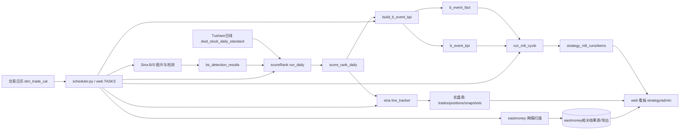
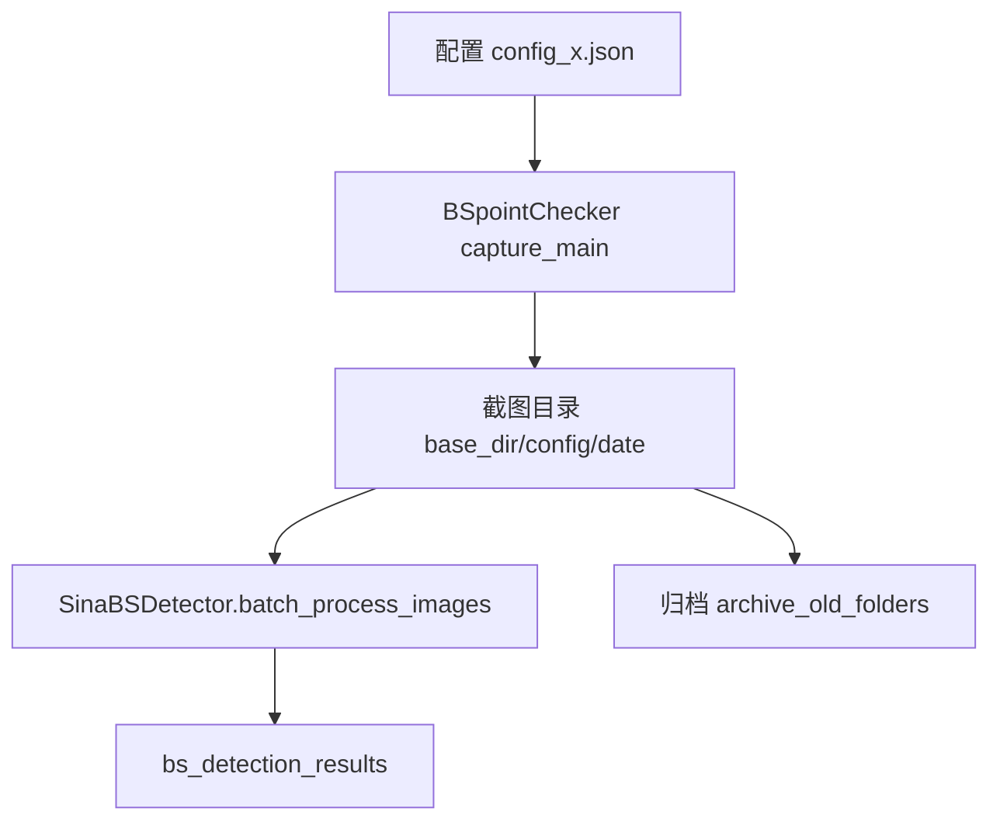
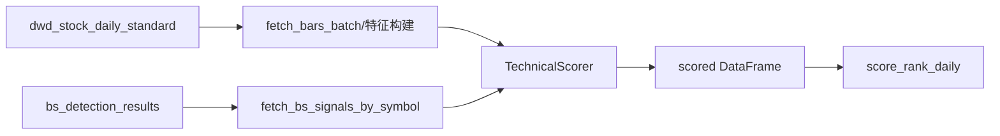
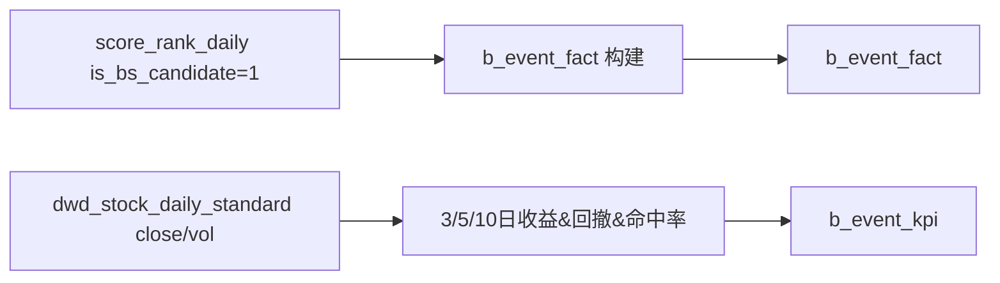
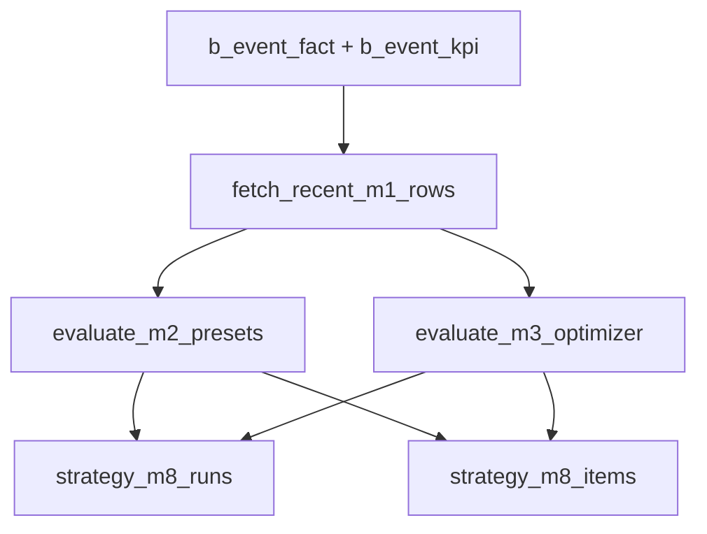
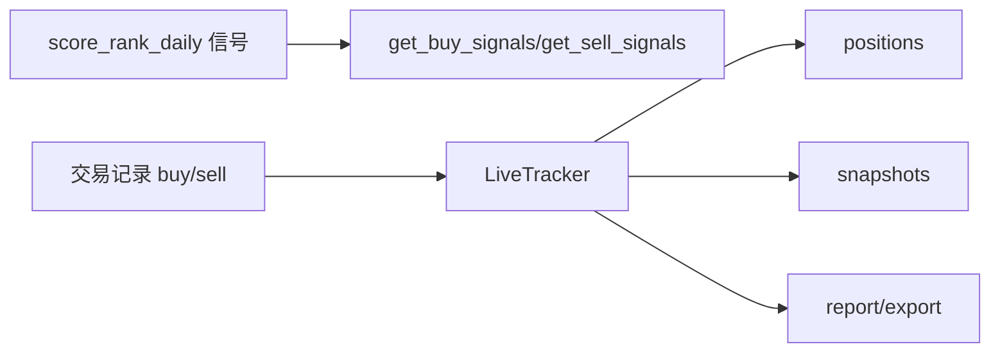

1 file changed
+201
-0

docs/业务线数据流与加工逻辑.md
# Chenyiyun2087 项目业务线数据流图与加工逻辑梳理

> 基于代码入口与任务编排梳理，按“采集 → 评分 → 策略评估 → 实盘同步 → 可视化/运维”主链路组织。

## 1. 总体数据流（跨业务线）

---

## 2. 业务线A：调度编排（独立调度器 + Web 调度）

### 2.1 独立调度器 `scheduler.py`

- 固定时点任务：
  - 15:20：`sina/bs_detection/main.py`
  - 16:30：`eastmoney/main.py`
  - 21:00：`run_pipeline()` 串行执行 `eastmoney/run_strategy.py` → `scoreRank/run_daily.py` → `build_b_event_kpi.py` → `run_m8_cycle.py` → `run_live_tracker.py sync`。
- 交易日过滤：通过 `dim_trade_cal` 判定是否交易日。
- 数据就绪门禁：21:00 流水线启动前轮询 `dwd_stock_daily_standard` 当日记录量。
- 任务执行方式：子进程脚本执行，日志输出到 `logs/scheduler/`。

### 2.2 Web 内置调度 `web/app.py`

- 管理台维护任务元信息（脚本、调度时间、仅交易日开关）。
- 支持手工触发 + 后台循环定时触发。
- 执行状态与历史写入 `app_task_status`、`app_task_history`（代码中有状态更新/历史落库链路）。

### 2.3 调度线处理逻辑小结

1. 先判交易日，再判数据可用性（独立调度器）。
2. 上游采集（Sina/Eastmoney）与下游加工（Score/M8/Live）按顺序串联。
3. Web 调度更偏“运维可控 + 可回放”，独立调度更偏“固定生产流水线”。

---

## 3. 业务线B：Sina B/S 信号采集与检测

### 3.1 输入

- 配置文件（截图源、并发、MySQL等）。
- 日期参数（`YYYYMMDD`）与可选股票列表。

### 3.2 加工环节

1. **截图阶段**：调用 `capture_main` 拉取股票图像。
2. **检测阶段**：`batch_process_images` 并发识别 B/S 信号并落库。
3. **归档阶段**：按天归档旧目录，减少本地存储压力。

### 3.3 输出与下游

- 核心输出表：`bs_detection_results`。
- 下游消费方：`scoreRank/cli/run_daily.py` 在评分时按 symbol 读取最近买点价格（`buy_point_close`）参与衍生字段构造。

---

## 4. 业务线C：ScoreRank 日频评分（M1）

### 4.1 输入

- 行情主数据：`dwd_stock_daily_standard`。
- B/S检测辅助数据：`bs_detection_results`（买点收盘价）。

### 4.2 核心加工

1. 获取股票池与行情序列。
2. 计算技术因子分（trend、breakout、volume、rs、contraction、liquidity）。
3. 可选融合优化分（`opt_score`）与其他扩展分。
4. 生成 trade/watch 分层和候选标签。

### 4.3 输出

- 目标表：`score_rank_daily`（按 `trade_date` 清后重写）。
- 下游：
  - `build_b_event_kpi.py`（事件事实与收益KPI）
  - `live_tracker`（信号联动）

---

## 5. 业务线D：事件事实/KPI 与 M8 回归优化

### 5.1 `build_b_event_kpi.py`（M1衍生）

- 从 `score_rank_daily` 取 B 候选事件，写入 `b_event_fact`。
- 结合未来窗口价格与成交量，计算 `ret_3/5/10`、`hit_x_10pct`、`mdd_x` 写入 `b_event_kpi`。
- 内置风险标签：ST、停牌当日、停牌窗口等。

### 5.2 `run_m8_cycle.py`（M2/M3评估 + 持久化）

- 启动前做新鲜度校验：
  - `bs_detection_results` vs `score_rank_daily` 日期一致性
  - `b_event_fact` vs `score_rank_daily` 缺失/冗余检查
  - 需要时自动触发 `build_b_event_kpi.main()` 重建
- 以最近 N 个 `event_date` 样本执行 M2/M3，并将总结JSON与Top结果落库。

---

## 6. 业务线E：Eastmoney 舆情扫描与盘后策略

### 6.1 批量舆情扫描 `eastmoney/main.py`

- 从参数或数据库拉取股票列表。
- `DataController.scan_sentiment` 并发抓取多空占比。
- 输出执行统计（成功/失败/耗时）并保存扫描结果。

### 6.2 盘后策略 `eastmoney/run_strategy.py`

- 使用 `PostMarketScanner` 按空方阈值筛选超跌反弹候选。
- 支持日报生成、Excel导出、预警输出。
- 在 21:00 流水线首步执行，给夜间复盘与次日候选提供输入。

---

## 7. 业务线F：实盘跟踪（Live Tracker）

- CLI 子命令覆盖：买卖记录、持仓查看、价格同步、日快照、信号读取、报告导出。
- `sync` 会拉取最新价格并更新持仓估值；`snapshot` 计算当日权益与收益。
- 在主调度链中作为收口环节，用于把策略信号映射为实盘可追踪状态。

---

## 8. 建议的“业务线视角”落地看板

1. **数据采集线**（Sina/Eastmoney）：关注任务成功率、数据覆盖率、失败重试。
2. **评分加工线**（ScoreRank）：关注评分分布、候选数量、入池阈值稳定性。
3. **策略评估线**（B事件/M8）：关注 hit@10%、回撤、参数漂移和样本新鲜度。
4. **实盘执行线**（Live Tracker）：关注持仓收益、信号执行偏差、现金利用率。
5. **运维调度线**（Scheduler/Web）：关注 SLA（准点率）、失败告警与任务锁冲突。

