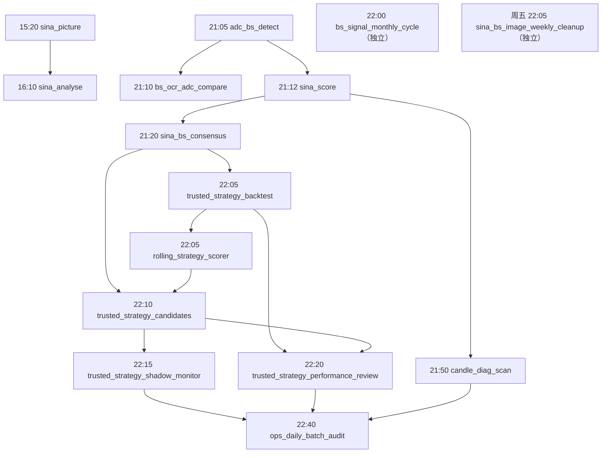

# 系统批量任务与消息推送运维总览

本文档整理生产自动批量任务的默认时间、依赖关系、消息推送和排障入口。

配置口径以 `task_registry/pipeline.yaml` 中状态为 `enabled` 的任务为准；本文记录的是仓库默认值，不代表管理员后台当前保存的运行时启停与时间。任务定义和入队逻辑由 `web/app.py` 提供，实际调度与执行由独立的 `scripts/ops/task_queue_worker.py` 承担；Web 重启不会终止正在执行的批任务。历史文件 `archive/scheduler.py` 不参与生产运行。

Validation V2 新增交易日 21:55 的 `pit_forward_shadow_collection`：只读冻结当前可用数据到主副 Evidence Store，并在数据日等于实际运行交易日且关键组件全部成功时累计技术 Shadow。该任务固定为 `PARTIAL_FORWARD_ONLY`，不会把历史补采或滞后数据计入真实 Shadow。

## 1. 时间顺序

### 1.1 盘中任务

| 时间 | 任务 ID | 内容概要 | 执行脚本 | 交易日限制 | 默认状态 |
|---|---|---|---|---|---|
| 15:20 | `sina_picture` | 批量截取 Sina 财经 B/S 信号图片 | `sina/bs_detection/main.py` | 仅交易日 | 启用 |
| 16:10 | `sina_analyse` | 分析当日截图、识别 B/S 买卖点并落库 | `sina/bs_detection/main.py` | 仅交易日 | 启用 |

### 1.2 日终任务

| 时间 | 任务 ID | 内容概要 | 执行脚本 | 交易日限制 | 默认状态 |
|---|---|---|---|---|---|
| 21:05 | `adc_bs_detect` | 使用数据库量价数据生成当日 B/S 检测结果 | `scoreRank/cli/detect_bs_points.py` | 仅交易日 | 启用 |
| 21:10 | `bs_ocr_adc_compare` | 对比 OCR 与 ADC 两类 B/S 信号来源 | `scripts/research/compare_bs_sources.py` | 仅交易日 | 启用 |
| 21:12 | `sina_score` | 计算全 A 股多因子评分并落库 | `scoreRank/run_daily.py` | 仅交易日 | 启用 |
| 21:20 | `sina_bs_consensus` | 复算 B 点增强分、研究分、综合分和建议 | `scoreRank/cli/build_bs_consensus.py` | 仅交易日 | 启用 |
| 22:05 | `trusted_strategy_backtest` | 运行当日可信生产策略回测 | `scripts/ops/run_daily_strategy_backtest.py` | 仅交易日 | 启用 |
| 22:05 | `rolling_strategy_scorer` | 计算滚动策略评分、轮动权重和风险敞口 | `scripts/ops/run_rolling_strategy_scorer.py` | 仅交易日 | 启用 |
| 22:10 | `trusted_strategy_candidates` | 导出 Top5 生产候选，写入信号和订单草案 | `scripts/ops/export_trusted_strategy_candidates.py` | 仅交易日 | 启用 |
| 22:15 | `trusted_strategy_shadow_monitor` | 复盘上一信号日订单的开盘可成交性、滑点和风险状态 | `scripts/ops/run_trusted_strategy_shadow_monitor.py` | 仅交易日 | 启用 |
| 22:20 | `trusted_strategy_performance_review` | 汇总策略收益、回撤、候选、影子盘和实盘状态 | `scripts/ops/run_integrated_strategy_review.py` | 仅交易日 | 启用 |
| 21:50 | `candle_diag_scan` | 扫描全市场 K 线反转、突破等形态 | `scripts/ops/run_candle_diag_daily_scan.py` | 仅交易日 | 启用 |
| 22:00 | `bs_signal_monthly_cycle` | 执行 B 点模型月度训练、写回和评估闭环 | `scripts/ops/run_monthly_bs_signal_enhancement_cycle.py` | 仅交易日 | 启用 |
| 22:40 | `ops_daily_batch_audit` | 巡检当日计划任务、通知结果并识别待补跑项 | `scripts/ops/run_integrated_batch_audit.py` | 仅交易日 | 启用 |

`bs_signal_monthly_cycle` 虽名为“月度闭环”，当前 YAML 默认仍按每个交易日进入调度；脚本内部负责判断是否需要实际执行。

### 1.3 周度任务

| 时间 | 星期 | 任务 ID | 内容概要 | 执行脚本 | 交易日限制 | 默认状态 |
|---|---|---|---|---|---|---|
| 22:05 | 周五 | `sina_bs_image_weekly_cleanup` | 删除上一周 Sina B/S 检测图片目录 | `scripts/ops/cleanup_sina_bs_detection_images.py` | 不限交易日 | 启用 |

计划时间是“允许入队的时间”，不是保证开始或完成的时间。任务只有在同一业务日的全部上游依赖成功后才能执行；上游运行较慢时，下游会等待，而不是越过依赖消费旧数据。

## 2. 依赖顺序

- `sina_picture -> sina_analyse` 来自 `web/app.py` 的兼容依赖定义；当前 YAML 未重复声明。
- 日终主链其他依赖来自 YAML 的 `depends_on`。
- `bs_ocr_adc_compare` 必须等待同一业务日的 `adc_bs_detect` 成功，避免在 ML 全量结果写入前产生空对比。
- `bs_signal_monthly_cycle` 和周清理任务没有调度层上游依赖。
- 非交易日时，仅交易日任务会以成功跳过记录终态；周清理仍按星期判断。

## 3. 消息推送内容

### 3.1 通用任务终态通知

调度器在任务结束后生成 `【批任务终态】` 通知，内容包括：

- 任务名称和任务 ID；
- 业务日、触发方式、成功或失败状态；
- 开始时间、完成时间和耗时；
- 任务输出、校验结果或错误摘要。

通用通知发送到后台启用且 URL 合法的飞书、企业微信、钉钉和自定义 Webhook。每次投递写入 `app_notification_delivery`；飞书未配置或投递失败时进入通知发件箱，由后台 outbox 循环重试。

### 3.2 业务摘要推送矩阵

| 时间 | 任务 | 通知类型 | 推送内容概要 |
|---|---|---|---|
| 22:20 | `trusted_strategy_performance_review` | `trusted_strategy_performance_review` | 唯一日终综合简报：收益回撤、滚动评分、候选与订单、影子盘、实盘快照、风险提醒和 Top5 |
| 22:40 | `ops_daily_batch_audit` | `ops_daily_batch_audit_incident` | 异常型巡检：仅异常日推送；健康日静默。内容为巡检结论、需确认补跑数量和异常任务列表 |

`rolling_strategy_scorer`、`trusted_strategy_candidates`、`trusted_strategy_shadow_monitor` 为综合简报数据源，正常成功不单独推送；其内容统一并入 22:20 综合简报。

这些业务摘要通过经审计的飞书发送函数投递，使用“通知类型 + 任务 + 业务日”的去重键。历史补发会增加 `【历史补发】` 前缀。

若某任务在该业务日已经存在成功的业务型通知，调度器把它视为完成通知，不再重复发送通用终态通知。业务推送失败或不存在时，仍会发送通用终态通知。因此，某任务只有一条业务卡片而没有另一条“完成”消息通常是正常去重，不代表终态通知丢失。

## 4. 手工补跑与排障

生产环境使用 `scripts/ops/install_web_launchd.sh` 同时安装 Web 与独立任务 worker。worker 启动时强制检查项目 `.venv`、关键 Python 依赖、数据库凭据和任务脚本，并通过数据库租约拒绝第二个 worker。`scripts/ops/check_web_console.sh` 必须同时检查两个服务。

自动重试仅用于数据库死锁、连接中断和超时等瞬态故障；缺依赖、参数错误、测试失败和产物校验失败不会盲目重跑。月度模型任务只有在测试、检查、报告和导入全部成功后才原子切换生产模型。

### 4.1 推荐操作入口

优先使用 Web `/admin` 任务中心，不要直接启动历史调度器。后台提供：

- 任务启停和时间配置；
- 单任务手工运行；
- 队列查看、重试和取消；
- 任务锁和心跳检查；
- 执行历史、退出码和错误摘要；
- 日终批量巡检、确认后补跑；
- 通知渠道配置和投递结果。

数据库中的后台配置可能覆盖本文所列默认时间和启停状态。排查“为什么此刻没有运行”时，应先查看 `/admin` 的实际配置，再核对 YAML 默认值。

### 4.2 历史任务安全边界

- 普通手工补跑应沿用任务中心的队列、同业务日幂等键和依赖检查。
- 历史安全补跑会避免产生真实订单或重复业务推送；不同任务由调度器转换为相应安全参数，例如轮动评分使用 `--no-push`、候选导出使用 `--no-emit-orders`。
- 确实需要补发历史业务消息时，显式使用“历史补发”，确保消息带前缀且经过审计去重。
- 不要绕过依赖直接补跑下游候选或收益评估；先确认同业务日上游产物完整。

### 4.3 排障数据入口

| 入口 | 用途 |
|---|---|
| `app_task_queue` | 查看入队状态、尝试次数、退出码和队列消息 |
| `app_task_lock` | 查看任务锁、持有者、心跳和异常占锁 |
| `app_task_history` | 查看触发方式、开始/结束时间、终态和日志摘要 |
| `app_task_status` | 查看任务中心展示的最近运行状态 |
| `app_notification_delivery` | 查看各渠道业务日投递结果、原因和去重键 |
| `app_daily_batch_audit` | 查看日终巡检分类、异常原因和是否需要补跑 |
| `/admin` | 统一查看配置、队列、历史、锁、通知和巡检结果 |

建议按“运行时配置 -> 上游依赖 -> 队列 -> 锁与心跳 -> 执行历史 -> 业务产物 -> 通知投递 -> 日终巡检”的顺序排查。

## 5. 已知差异与维护规则

- `task_registry/pipeline.yaml` 是唯一允许启用生产调度的任务目录；数据库旧配置和 `web/app.py` 的历史兼容定义不能额外启用任务。
- `web/app.py` 仍保留硬编码 `TASKS` 作为兼容回退，部分默认时间和附近注释早于 YAML，不能用这些旧值替代 YAML 正文。
- `db_bs_detect` 仅保留为历史记录的展示定义，已从调度集合永久排除，不能被数据库旧配置重新启用。
- `sina_analyse` 的截图依赖目前来自兼容代码而非 YAML。若未来彻底移除硬编码回退，应先把该依赖补入 YAML。
- `archive/scheduler.py` 仅作历史参考；生产事故复盘以 Web 队列、历史表和通知投递记录为准。
- 研究、维护、迁移、导出脚本以及仅可手工运行的任务不属于本文生产自动任务清单。
