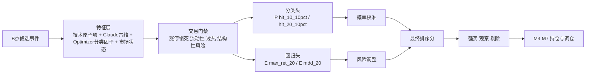
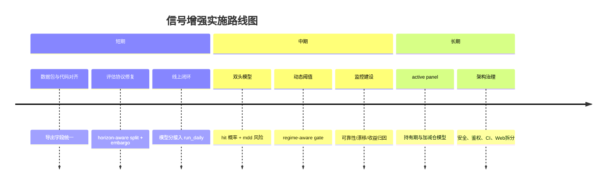

# Chenyiyun2087 项目买点信号增强深度研究报告

## Executive Summary

本次研究以用户指定仓库 `chenyiyun2087/Chenyiyun2087` 为主证据源，并结合仓库内同批次导出的信号增强数据包进行审阅。高置信度结论有四个。其一，这个项目已经形成了相对完整的 A 股买点流水线：`bs_detection_results` 抓取 B/S 点，`scoreRank/cli/run_daily.py` 做全市场评分并落库，`web/strategy_playbook.py` 与 `scoreRank/cli/run_m8_cycle.py` 继续做 M2~M8 评估和调仓支持。其二，仓库代码与已导出数据包之间存在“版本错位”：当前代码里已经有 `bs_score_v2`、`bs_research_score`、`bs_consensus_score`、市场状态特征和训练脚本，但导出的旧数据包仍主要停留在 `bs_score` + 20 日路径级别，这会直接限制离线建模上限。其三，当前系统最主要的问题不是“没有评分”，而是“评分还没有彻底概率化、风险化、分阶段化”：训练脚本已经存在，但推理结果尚未真正接入日常打分主链路。其四，工程上仍有若干 P0/P1 问题需要同步解决，尤其是数据库凭据硬编码、安全鉴权、`SUBSTR(ts_code, 1, 6)` 带来的索引失效、重复取数和结果保存链路未完全打通等。fileciteturn8file0L1-L1 fileciteturn20file0L1-L1 fileciteturn21file0L1-L1 fileciteturn23file0L1-L1 fileciteturn24file0L1-L1

仓库内导出的 `README_FOR_EXPERT.md` 与 `summary.json` 表明，这批信号增强数据包覆盖 2026-01-22 至 2026-05-08，共 905 条首次 B 点事件、732 条带 10 日标签事件、8521 条 B 点有效状态日切片、242 条最新候选。字段字典清楚区分了“当时可见信号字段”和“未来标签字段”，并明确规定 `ret_* / max_ret_* / mdd_* / hit_* / days_to_*` 只能作为标签而不能作为特征。仓库内已有一份 2026-05-10 的买点增强研究报告，结论也指向同一个方向：当前 B 点更像“会出现冲高机会的交易事件流”，而不是“天然适合中期持有的高胜率买入信号”；因此升级重点应从“继续手工调权重”转向“在 B 点候选内做命中概率、上涨空间与回撤风险的联合排序”。fileciteturn48file0L1-L1 fileciteturn49file0L1-L1 fileciteturn50file0L1-L1 fileciteturn25file0L1-L1

按照用户要求，我优先从以下 GitHub 文件开始检索，并按这个顺序建立证据链。这个顺序的原则是先确定架构与主链路，再进入评分公式与特征，再看训练/回测，再补工程与安全问题，最后核对已经实施的升级内容。

| 检索顺序 | 文件路径 | 作用 |
|---|---|---|
| 首先 | `README.md` | 确认项目架构、主流程、M2~M8 链路、调度与模块边界 |
| 然后 | `scoreRank/cli/run_daily.py` | 审阅实时/离线评分入口、候选池构建、落库逻辑、延迟门禁 |
| 然后 | `scoreRank/core/scorer.py` | 审阅技术特征、权重、阈值、风险扣分、缺失值处理 |
| 然后 | `scoreRank/core/config.py` | 固化所有核心阈值、窗口、权重、交易池门槛 |
| 然后 | `scoreRank/strategies/technical.py` | 确认评分主调用链与数据抓取方式 |
| 然后 | `scoreRank/strategies/claude.py` | 审阅六维因子来源与子分项结构 |
| 然后 | `scoreRank/core/bs_enhanced_score.py` | 审阅 B 点增强分、V2、研究分、共识分公式 |
| 然后 | `scripts/export_signal_enhancement_dataset.py` | 审阅训练样本构建、特征白名单、标签窗口、切分逻辑 |
| 然后 | `scripts/train_bs_signal_model.py` | 审阅模型类型、校准方式、评价指标、输出物 |
| 然后 | `scoreRank/cli/run_m8_cycle.py` 与 `web/strategy_playbook.py` | 审阅回测、样本构建、M2~M8 评估与组合逻辑 |
| 最后 | `PROJECT_OPTIMIZATION.md`、`test/ScoreRank/test_bs_enhanced_score.py`、`scoreRank/core/db_io.py`、`scoreRank/core/logging_utils.py` | 校验已实施升级、剩余技术债、日志与测试覆盖情况 |

上述文件路径都在仓库内可直接定位，是本报告后续判断的主要依据。fileciteturn5file3L1-L1 fileciteturn6file1L1-L1 fileciteturn15file0L1-L1 fileciteturn18file0L1-L1 fileciteturn14file0L1-L1 fileciteturn30file1L1-L1 fileciteturn6file4L1-L1 fileciteturn5file0L1-L1 fileciteturn5file5L1-L1 fileciteturn22file0L1-L1 fileciteturn4file0L1-L1 fileciteturn6file14L1-L1

## 仓库与数据包现状

项目主链路已经相当明确。`README.md` 把系统拆成调度层、数据采集层、评分层、策略评估层、实盘与信号层、回测层、展示层；其中与本次“买点信号增强”最直接相关的是 `sina/bs_detection/` 的 B/S 识别，`scoreRank/cli/run_daily.py` 的日频评分落库，`scripts/export_signal_enhancement_dataset.py` 的训练样本导出，以及 `scripts/train_bs_signal_model.py` 的模型训练。收盘后链路的关键节奏是：15:20 截图，16:10 买卖点分析，21:00 跑全 A 股评分，21:10 跑 M8 回归与仓位更新；`run_daily.py` 本身也默认要求 16:30 后才执行，除非显式传入 `--force` 或 `--date`。这意味着当前系统是典型“盘后更新、次交易日执行”的离线评分体系，而不是严格的盘中低延迟打分体系。fileciteturn8file0L1-L1 fileciteturn20file0L1-L1

技术评分层的核心公式仍然是规则型打分。`scoreRank/core/scorer.py` 从 QFQ 行情构造 `ma5/10/20/60`、突破距离、量比、20 日收益、波动收敛、乖离等特征，再从 RAW 行情构造 `avg_amount20`、`avg_price20`、停牌近似、涨停锁死等风险特征，最后按配置文件权重合成为 `base_score`，再减去 `penalty` 形成 `score`。`scoreRank/core/config.py` 把权重和阈值固化为：`breakout=0.22`、`trend=0.12`、`volume=0.12`、`rs=0.12`、`contraction=0.10`、`liquidity=0.10`；默认 `lookback_days=160`、`breakout_n=20`、`trade_threshold=75`、`watch_threshold=60`、`min_avg_amount20=50_000_000`，B 点 V2 的业务分层阈值则是 `72/58`。这个配置说明当前系统是典型的“固定权重 + 固定业务阈值”方案，便于解释，但对市场状态变化缺乏自适应。fileciteturn16file0L1-L1 fileciteturn19file0L1-L1

第二层评分是 `ClaudeScorer`。`scoreRank/strategies/claude.py` 明确把评分拆成六个维度：`momentum / value / quality / technical / capital / chip`，并且这些维度并不是虚构的抽象标签，而是分别从 `dwd_stock_daily_standard`、`dwd_daily_basic`、`dwd_fina_indicator`、`ods_moneyflow`、`ods_margin_detail`、`ods_cyq_perf` 等表里实时抓取原子因子再合成总分。换句话说，仓库上游其实已经具备更丰富的原子特征供建模使用；但在导出给专家的数据包中，这些信息大多只以 `claude_score` 总分形式出现，没有把六个子分项原样透出，这是当前数据包信息损失最大的地方之一。fileciteturn31file0L1-L1 fileciteturn12file0L1-L1

B 点增强层在仓库里已经明显升级。`scoreRank/core/bs_enhanced_score.py` 不仅有旧版 `bs_score`，还已经实现了 `bs_score_v2`、`bs_research_score` 和 `bs_consensus_score`。旧版 `bs_score` 主要是 `score + opt + claude + s_rs + s_breakout + entry_timing - risk_penalty` 的线性融合；`bs_score_v2` 进一步引入了 `liquidity`、`contraction`、三分一致性 `consensus`、`rs_liquidity`、`breakout_volume`；`bs_research_score` 又再叠加了一层市场环境修正，例如 `market_hs300_ret_20`、`market_regime`；`bs_consensus_score` 则预留了与模型概率 `bs_model_prob` 的共振接口。问题在于：仓库内导出的旧数据包只有 `bs_score` 和 `bs_entry_score`，而没有带出 `bs_score_v2 / bs_research / bs_consensus`；这意味着“代码已经升级，但训练样本仍用旧版字段”的错位客观存在。fileciteturn9file0L1-L1 fileciteturn48file0L1-L1 fileciteturn49file0L1-L1

样本构建层也已经相当清晰。仓库中的 `README_FOR_EXPERT.md` 和 `summary.json` 显示，这一批信号增强数据包包含 905 条首次 B 点事件、732 条带 10 日标签样本、8521 条 active panel、242 条最新候选，时间范围是 2026-01-22 至 2026-05-08。`DATA_DICTIONARY.md` 明确说明了字段含义，并把 `sample_split` 定义为按时间切分的 `train / validation / test`。但 `scripts/export_signal_enhancement_dataset.py` 的实现又显示，当前代码中的默认 horizon 实际已经扩展到了 `(1,3,5,10,20,60)`，还加入了 `score_opt_gap`、`score_claude_gap`、`score_dispersion`、`rs_liquidity_combo`、`breakout_volume_combo`、市场状态等工程特征。也就是说，仓库代码已经走向“更强的数据包”，但仓库 checked-in 的导出文件夹仍是旧版 20 日包。这是本项目当前最重要的版本管理问题之一。fileciteturn48file0L1-L1 fileciteturn49file0L1-L1 fileciteturn50file0L1-L1 fileciteturn12file0L1-L1

下面这组默认假设和可调参数，建议在后续所有回测、评审和上线文档中标准化披露，否则不同阶段的结论不可比。

| 参数类别 | 当前默认值 | 来源 | 建议处理 |
|---|---:|---|---|
| 技术回看窗口 | 160 天 | `scoreRank/core/config.py` | 保留为配置参数，并记录版本号 |
| 突破窗口 | 20 天 | `scoreRank/core/config.py` | 做 10/20/30 三档网格 |
| 技术业务阈值 | 75 / 60 | `scoreRank/core/config.py` | 保留为老规则基线 |
| B 点 V2 阈值 | 72 / 58 | `scoreRank/core/config.py` | 改为按市场状态动态阈值 |
| 初始资金 | 100 万 | `sina/backtest/backtest_config.py` | 在回测中作为独立参数暴露 |
| 滑点 | 0.1% | `sina/backtest/backtest_config.py` | 建议做 0.1% / 0.2% / 0.3% 敏感性分析 |
| 手续费 | 0.15% | `sina/backtest/backtest_config.py` | 拆成买卖双边并显式披露 |
| TopN | 10 | `sina/backtest/backtest_config.py` | 与 5 / 20 并行评估 |
| 风险自由利率 | 2% | `sina/backtest/backtest_config.py` | 与夏普口径统一 |
| 市场状态 | `risk_on / neutral / risk_off` | `scoreRank/core/market_context.py` | 用于分桶训练与分桶阈值 |

fileciteturn19file0L1-L1 fileciteturn47file0L1-L1 fileciteturn40file0L1-L1

## 关键发现与风险

最关键的发现，是“训练能力已经出现，但线上推理还没有真正闭环”。`scripts/train_bs_signal_model.py` 已经实现了一个可训练、可校准、可产出 `p_signal` 的逻辑回归模型。它会读取数据包、按白名单抽特征、排除 `ret_ / max_ret_ / mdd_ / hit_ / days_to_` 前缀字段，使用 `LogisticRegression(class_weight="balanced")` 训练，再用 `CalibratedClassifierCV(..., method="sigmoid")` 在 validation 段做概率校准，并输出 `metrics.json`、`MODEL_REPORT.md`、`latest_candidates_scored.csv`。这其实已经具备“从规则分走向概率分”的雏形。fileciteturn10file0L1-L1

但 `run_daily.py` 只把 `bs_model_prob`、`bs_model_rank_score`、`bs_model_version` 加进了数据库 schema 预留列，并没有把模型推理真正接入评分主流程。保存时的 `cols_map` 只包含 `bs_score / bs_entry_score / bs_score_v2 / bs_research / bs_consensus` 等字段，没有包含 `bs_model_prob / bs_model_rank_score / bs_model_version`。这意味着：训练脚本存在，表结构也预留了，但线上日常打分链路仍主要在运行规则分，而不是模型分。这一断点会让“研究好像已经完成、生产上实际上没用上”的情况长期存在。fileciteturn20file0L1-L1 fileciteturn10file0L1-L1

第二个关键发现，是数据版本错位与标签切分协议仍不够严谨。旧数据包文档显示它主要面向 10/20 日目标，价格路径文件也只有 `first_buy_price_paths_20d.csv`；而当前导出脚本代码已经定义到 60 日 horizon，并引入了市场环境与更多工程特征。与此同时，`sample_split` 是基于 `event_date` 时间切分，而不是“目标 horizon 完整可观测后再切分”。对于 10 日和 20 日目标，这会导致样本尾部天然缺少完整标签，从而让 test 段的统计显著性变弱甚至失真。因此，当前最应该先修的是“horizon-aware split + purged walk-forward”，而不是继续微调阈值。fileciteturn48file0L1-L1 fileciteturn49file0L1-L1 fileciteturn50file0L1-L1 fileciteturn12file0L1-L1

第三个关键发现，是当前评分体系存在明显的重复计权风险。`score` 本身已经包含趋势、突破、量能、RS、收敛、流动性、乖离等信息；`claude_score` 又整合了动量、估值、质量、技术、资金、筹码六维；`opt_score` 再把 momentum / value / quality / technical / capital / chip / size 组合了一遍；`bs_score` 又额外把 `s_rs` 和 `s_breakout` 单独加了一次。只要没有系统化训练与特征重要性审查，这种“强相关旧分数的反复再加权”非常容易让模型看起来复杂，但实际上增量信息很少。仓库内 2026-05-10 的研究报告也直指这一点：当前系统更需要 B 点专用评分层，而不是继续让旧总分承担全部职责。fileciteturn16file0L1-L1 fileciteturn31file0L1-L1 fileciteturn20file0L1-L1 fileciteturn9file0L1-L1 fileciteturn25file0L1-L1

第四个关键发现，是工程性能瓶颈虽然已有部分修复，但仍未彻底解决。`PROJECT_OPTIMIZATION.md` 记录了若干已修复问题，包括 `adj_type` 语义 bug、`groupby().transform()` 向量化优化、连接池接入、动态涨停阈值修复等；这些变化也能在 `scoreRank/core/db_io.py` 和 `scoreRank/core/logging_utils.py` 中看到落地痕迹。可问题在于，`fetch_bars_batch()` 仍然在 `WHERE` 条件里使用 `SUBSTR(ts_code, 1, 6)`，这会持续拖累索引使用；而 `run_daily.py` 在 `TechnicalScorer.score()` 已经完成一次市场数据抓取后，又单独再抓一遍 `raw_data` 来做 enrichment，形成重复 I/O。换句话说，项目已经从“明显慢”走到“可用”，但离“高效、可扩展、可上线大样本滚动训练”仍有一段距离。fileciteturn24file0L1-L1 fileciteturn36file0L1-L1 fileciteturn17file0L1-L1 fileciteturn20file0L1-L1 fileciteturn39file0L1-L1

第五个关键发现，是安全与合规技术债仍然足够严重，必须与信号增强一起处理。仓库多个文件把数据库密码直接硬编码在源码里，包括 `scoreRank/core/config.py`、`scripts/export_signal_enhancement_dataset.py`、`sina/backtest/backtest_config.py`；`PROJECT_OPTIMIZATION.md` 还指出 `web/app.py` 存在默认 `secret_key` 和交易执行 API 缺少鉴权的问题。对量化系统而言，这不是“代码洁癖”，而是生产风险：一旦研究脚本、看板或交易接口暴露，影响会比评分误差更严重。fileciteturn19file0L1-L1 fileciteturn12file0L1-L1 fileciteturn47file0L1-L1 fileciteturn24file0L1-L1

下面这张表概括了本次代码审阅中最重要的缺陷与风险点。

| 类别 | 关键问题 | 影响 | 当前状态 |
|---|---|---|---|
| 模型闭环 | 训练脚本已存在，但模型分未真正接入 `run_daily` 保存链路 | 研究与生产脱节 | 未完成 |
| 数据协议 | 导出包与主干代码版本不一致，旧包缺少 v2/研究分/市场状态/60日标签 | 限制离线信号增强 | 未完成 |
| 特征设计 | `score / opt / claude / bs` 重复计权，增量信息可能不足 | 排序力上限受限 | 未完成 |
| 切分方法 | `sample_split` 对 10 日/20 日目标不够 horizon-aware | 样本外结果失真 | 未完成 |
| 性能 | `SUBSTR(ts_code,1,6)`、重复抓取 K 线 | 扩展性差、日常耗时高 | 部分修复 |
| 安全 | 密码硬编码、默认 secret_key、交易 API 无鉴权 | 生产级风险 | 未完成 |
| 可观测性 | `scoreRank` 已有 JSON logging，但全仓仍不一致 | 排障效率有限 | 部分修复 |
| 测试 | `bs_enhanced_score` 有单测，但核心链路全面覆盖不足 | 迭代风险高 | 部分修复 |

上述问题大多能够在仓库文件中直接定位。fileciteturn20file0L1-L1 fileciteturn10file0L1-L1 fileciteturn12file0L1-L1 fileciteturn24file0L1-L1 fileciteturn29file0L1-L1 fileciteturn39file0L1-L1

## 信号增强方案

下面给出六种可执行的增强方案。它们并不是互斥关系，而是一条逐层升级路线：先做特征暴露与评估协议修复，再做双阶段概率化排序，最后再进入更强的非线性模型与持仓管理。

| 方案 | 原理 | 需要的数据/代码改动 | 预期效果 | 风险 | 验证方法 |
|---|---|---|---|---|---|
| 规则强化版 B 点排序 | 在旧规则基础上，把 `s_rs / s_liquidity / s_breakout / 市场状态` 提前到核心地位，先做轻量增量 | 直接改 `bs_enhanced_score.py`，并补导出包字段 | 最快见效，能立刻提升候选排序质量 | 仍是手工规则，适应性有限 | 与现有 `bs_score` 做 walk-forward TopN 对比 |
| 双头模型 | 同时预测 `P(hit_10/20_10pct)` 与 `E(mdd_10/20)`，最终按风险调整得分排序 | 在 `train_bs_signal_model.py` 新增分类头+回归头；线上增加推理与存列 | 让“能涨”和“耐回撤”同时可控 | 开发量中等，需要统一目标口径 | 用 TopN 收益/回撤比和校准曲线测试 |
| 市场状态分桶模型 | 按 `market_regime`、`market_bs_ratio`、指数 20 日收益分桶训练不同参数或不同模型 | 导出包必须携带 `market_*` 字段；`run_daily` 已具备上下文字段基础 | 降低风格漂移导致的阈值失效 | 样本分桶后会更稀疏 | 分桶样本外对比与 PSI/漂移跟踪 |
| 原子特征回流 | 不再只导出 `claude_score` 和 `opt_score` 总分，而是导出六维子分项与分类因子原子项 | 修改 `export_signal_enhancement_dataset.py` 与 SQL 选择列 | 提高模型可学习性，避免总分信息损失 | 需要更大特征治理与缺失管理 | 做 ablation study，比较“总分版 vs 原子版” |
| 两阶段交易门禁 | 先判断“可买性”，再判断“优先级”；把涨停锁死、流动性过低、买点后过热等做硬门禁 | 新增 gate 函数，放在 `run_daily` 的业务标签前 | 降低假阳性和不可成交候选 | 覆盖率可能下降 | 监控覆盖率、命中率、最大回撤三者平衡 |
| 持有期序列模型 | 利用 `active_b_daily_panel_labeled.csv` 研究 B 点后第 2~N 天是否继续持有、加仓或退出 | 建立 continuation / add / exit 标签，接入 `active panel` | 把“选股”升级成“持有管理” | 标注复杂度高 | 用 active panel 做多阶段滚动回测 |

fileciteturn9file0L1-L1 fileciteturn10file0L1-L1 fileciteturn12file0L1-L1 fileciteturn40file0L1-L1 fileciteturn48file0L1-L1

我最推荐的主线路是“原子特征回流 + 双头模型 + 两阶段交易门禁”。原因很简单：仓库已经有 `ClaudeScorer` 和 `opt_score` 的上游能力，也已经有 `train_bs_signal_model.py` 的训练骨架，还已经预留了 `bs_model_prob` 等线上列；也就是说，项目并不缺基础设施，真正缺的是把这些碎片接成闭环。fileciteturn31file0L1-L1 fileciteturn10file0L1-L1 fileciteturn20file0L1-L1

为了让设计更清晰，推荐把最终信号增强结构收敛成下面的形态。



如果希望先做最短路径增量升级，可以先不立刻引入树模型，而是先在 `bs_enhanced_score.py` 里把旧规则升级为一个更贴近数据包结构的规则版“V3”。建议规则如下：

```text
gate =
  s_liquidity >= 20
  and is_limit_up == 0
  and price_change_ratio <= 8
  and penalty == 0

rank_score =
  0.30 * s_liquidity
+ 0.25 * s_rs
+ 0.20 * s_breakout
+ 0.10 * claude_score
+ 0.10 * opt_score*10
+ 0.05 * bs_entry_score

if market_regime == "risk_off":  rank_score += 5 when s_rs and liquidity both strong
if market_regime == "risk_on":   rank_score -= 3 when price_change_ratio already too high
```

这套轻量规则的优点是能与现有 `bs_score_v2 / bs_research_score` 思路保持一致，几乎不需要重构数据库表，只需要把数据包导出和主链路重新对齐。它不是终局，但非常适合作为短期 P0/P1 升级。fileciteturn9file0L1-L1 fileciteturn40file0L1-L1

## 实施优先级与路线图

下面给出我建议的短中长期路线。短期目标是“先修协议和闭环”，中期目标是“做概率化排序”，长期目标是“把买点信号提升为完整持仓决策层”。

| 阶段 | 工作项 | 预计开发工时 | 回测/算力需求 | 验收标准 |
|---|---|---:|---|---|
| 短期 | 统一数据包版本，导出 `bs_score_v2 / bs_research / market_* / 原子子分项` | 12–16 小时 | 单机即可 | 新数据包字段与主干代码一致 |
| 短期 | 修复 horizon-aware split，新增 20 日 embargo 的 walk-forward 切分 | 8–12 小时 | 单机即可 | train/val/test 在目标 horizon 上全部完整可观测 |
| 短期 | 把 `bs_model_prob / bs_model_rank_score / bs_model_version` 真正接入 `run_daily` 保存链路 | 8–10 小时 | 无额外资源 | 日常表里能看到模型分与版本号 |
| 短期 | 去掉重复取数，减少 `run_daily` 与 `TechnicalScorer` 的重复 DB I/O | 6–8 小时 | 无额外资源 | 日评耗时下降 20%+ |
| 中期 | 建立双头模型并做概率校准 | 24–40 小时 | CPU 足够，建议 nightly 训练 | 样本外 TopN hit/mdd 明显优于旧分 |
| 中期 | 引入市场状态分桶阈值与动态交易门禁 | 12–20 小时 | 单机即可 | 风格切换期排序稳定性提升 |
| 中期 | 接入模型监控、漂移监控、可靠性曲线与 ECE/Brier 看板 | 16–24 小时 | 轻量服务 + 日志 | 每日可观测模型质量与漂移 |
| 长期 | 用 `active_b_daily_panel_labeled.csv` 做 continuation / add / exit 管理 | 40–64 小时 | 需要更多回测资源 | 不只“选出来”，还能改善持有曲线 |
| 长期 | 全仓安全与架构治理：凭据、鉴权、Blueprint、CI | 32–56 小时 | DevOps 配合 | 生产安全/可维护性达标 |

fileciteturn12file0L1-L1 fileciteturn20file0L1-L1 fileciteturn10file0L1-L1 fileciteturn24file0L1-L1

建议的时间线可以概括为下面这张图。



## 回测与在线验证计划

回测层面，最重要的不是“多跑几次”，而是修正协议。当前应该采用“目标 horizon 完整可观测后再切分”的 walk-forward 方案，而不是沿用单一 `sample_split`。对 `hit_10_10pct`，训练集只应使用那些后续已经走完整个 10 日窗口的事件；对 `hit_20_10pct` 也是同理。每个目标独立切分，且在 train/validation/test 之间保留至少一个 horizon 的时间隔离带，避免尾部标签穿透。这个修正可以直接在 `export_signal_enhancement_dataset.py` 中实现。fileciteturn12file0L1-L1 fileciteturn49file0L1-L1

我建议把验证分成四层。第一层是样本外分类质量：ROC-AUC、Average Precision、Brier、ECE、分层命中率。第二层是交易排序质量：按日 `Top3 / Top5 / Top10` 计算 `avg_hit / avg_max_ret / avg_mdd`。第三层是组合视角：接入 M4/M6 口径后看净值、夏普、最大回撤、换手。第四层是实盘可执行性：次日开盘可买率、涨停不可成交率、平均成交额约束下的容量。前两层可以沿用 `train_bs_signal_model.py` 的指标框架，第三层可以直接衔接 `run_m8_cycle.py` 与 `web/strategy_playbook.py`，第四层则要结合 `sina/backtest/backtest_config.py` 里的成本参数继续扩展。fileciteturn10file0L1-L1 fileciteturn21file0L1-L1 fileciteturn23file0L1-L1 fileciteturn47file0L1-L1

在线验证建议分成灰度期与正式期。灰度期连续四周同时保留旧版 `bs_score_v2` 与新版 `model_rank_score`，但只让后者进入一个影子候选池，不直接驱动交易。正式期才把新版信号纳入前台排序。灰度期间每天至少记录六项：候选覆盖率、TopN 命中率代理、次日可买率、TopN 平均流动性、分层阈值命中分布、模型分与规则分分歧比例。这样既可以避免一次性切换，也能为 `bs_consensus_score` 提供真正的数据基础。仓库中的 `bs_consensus_score` 已经预留了“模型高分但规则不通过”的分歧标签，这个监控应成为灰度上线的核心指标之一。fileciteturn9file0L1-L1

交易成本和滑点不能只保留一个默认值。当前回测配置给了 `slippage=0.001`、`commission=0.0015`、`initial_capital=1_000_000`。建议在验证中至少做三档敏感性：乐观档 `10bp + 15bp`，中性档 `20bp + 15bp`，保守档 `30bp + 20bp`；同时叠加流动性容量约束，例如单标持仓不超过近 20 日平均成交额的一定比例。这样才能判断增强分提升是否足以覆盖真实摩擦成本。fileciteturn47file0L1-L1

统计显著性检验建议不要只做单次均值对比，而应采用按交易日为单位的配对区块自助法。具体来说，可以对“旧版 TopN 组合”与“新版 TopN 组合”的日度收益、日度最大回撤、日度 hit rate 做 block bootstrap，比较它们的均值差分置信区间；对分类概率则用可靠性曲线和 Brier 分解做校验；对多组参数搜索结果，应用一套固定的持出验证窗口，避免数据窥探式挑选冠军参数。这个方案与当前 `M2/M3 -> M4 -> M6` 的仓库结构是一致的，只是把验证协议做得更严格。fileciteturn21file0L1-L1 fileciteturn23file0L1-L1

## 代码审阅清单与可直接落地的改进建议

优先级最高的代码改动，有四个可以直接写成 PR。第一，是把训练出来的模型分真正接到生产链路。第二，是修复导出脚本，让数据包字段与主干评分代码一致。第三，是减少重复取数。第四，是把分数保存字段做成统一的 schema 常量，避免“建了列但没保存”的隐性断裂。fileciteturn20file0L1-L1 fileciteturn10file0L1-L1 fileciteturn12file0L1-L1

下面这段伪代码可以直接作为 `run_daily.py` 的改造草案。它做两件事：一是在计算完规则分之后补上模型推理；二是把 `bs_model_prob / bs_model_rank_score / bs_model_version` 写回落库 DataFrame。

```python
# scoreRank/cli/run_daily.py

from scoreRank.core.model_infer import load_latest_bs_model, score_latest_candidates

# 规则分完成后
scored = add_bs_enhanced_scores(scored)
scored = attach_market_context(scored, market_context)
scored = add_bs_enhanced_scores(scored)   # 建议拆分为基础规则分 + market-aware 重算

# 新增：模型推理
model_bundle = load_latest_bs_model(target="hit_20_10pct")
if model_bundle is not None:
    scored = score_latest_candidates(
        scored,
        model=model_bundle["model"],
        feature_cols=model_bundle["feature_cols"],
        model_version=model_bundle["version"],
    )
else:
    scored["bs_model_prob"] = None
    scored["bs_model_rank_score"] = None
    scored["bs_model_version"] = None

# 保存映射中显式加入三列
cols_map.update({
    "bs_model_prob": "bs_model_prob",
    "bs_model_rank_score": "bs_model_rank_score",
    "bs_model_version": "bs_model_version",
})
```

这项改动的价值极高，因为它能把研究脚本真正变成生产能力。fileciteturn20file0L1-L1 fileciteturn10file0L1-L1

第二个 PR 建议，是把 `export_signal_enhancement_dataset.py` 从“导出总分”升级为“导出原子子分项 + 市场状态 + horizon-aware splits”。关键不是多导几个字段，而是把已经在 `ClaudeScorer` 里算出来的六维子分项，以及 `opt_score` 的分类因子原子项真正释放给离线训练。否则模型永远只能围绕已损失信息的总分再学习。fileciteturn31file0L1-L1 fileciteturn12file0L1-L1

```python
# scripts/export_signal_enhancement_dataset.py

EXTRA_EXPORT_COLUMNS = [
    "score_momentum", "score_value", "score_quality",
    "score_technical", "score_capital", "score_chip",
    "market_hs300_pct_chg", "market_hs300_ret_5", "market_hs300_ret_20",
    "market_bs_ratio", "market_limit_up_rate", "market_regime",
]

# 训练切分要对每个 target 单独做
def add_target_aware_splits(df, horizons=(10, 20), embargo_days=20):
    out = df.copy()
    for h in horizons:
        target = f"hit_{h}_10pct"
        mask = out[target].notna()
        dates = sorted(pd.to_datetime(out.loc[mask, "event_date"]).dt.date.unique())
        # 先按完整可观测样本切，再加入 embargo
        # ...
        out[f"split_{target}"] = split_series
    return out
```

第三个 PR 建议，是减少重复取数。当前 `TechnicalScorer.score()` 内部已经执行了 `fetch_bars_batch()`，而 `run_daily.py` 后面又重新抓一遍同一批 symbol 的行情来做 enrichment。最简单的做法是让 `TechnicalScorer.score()` 返回一个 `scored, features` 二元组，或者把 features 缓存在 scorer 实例上，避免重复查询。fileciteturn17file0L1-L1 fileciteturn20file0L1-L1

第四个 PR 建议，是完善测试矩阵。当前 `test/ScoreRank/test_bs_enhanced_score.py` 已经覆盖了 `normalize_opt_score`、`entry_timing_score`、`bs_score_v2`、`bs_research_score`、`bs_consensus_score` 的基本边界，但按照 `PROJECT_OPTIMIZATION.md` 的审阅结论，`strategy_playbook.py`、评分归一化函数、M7 卖出规则等核心链路仍远未形成系统性单元测试。建议至少新增三组测试：目标切分测试、模型推理落库测试、重复字段与 schema 一致性测试。fileciteturn29file0L1-L1 fileciteturn24file0L1-L1

最后，建议补齐这份代码审阅清单，作为后续每个 PR 的必选项。

| 审阅点 | 通过标准 |
|---|---|
| 特征泄漏 | 不允许任何 `ret_* / max_ret_* / mdd_* / hit_* / days_to_*` 进入训练特征 |
| 目标切分 | 所有目标都必须按 horizon-aware split 切分，且有 embargo |
| 线上闭环 | 训练、导出、推理、落库使用同一份 feature schema 与版本号 |
| 重复取数 | 同一批 symbols 的同一时段行情不得重复抓取两次以上 |
| 字段一致性 | 表结构新增列必须出现在保存映射、导出脚本和模板展示层中 |
| 可回滚 | 新旧分数必须并行记录至少一个灰度周期 |
| 监控 | 每日记录候选覆盖率、可买率、漂移指标、规则/模型分歧比例 |
| 安全 | 凭据、secret_key、交易接口鉴权不能留在源码里 |

## 风险合规与开放问题

风险与合规层面，有三类事项必须同步纳入计划。第一类是数据许可与来源透明。项目 README 明确写了数据采集来自 Sina / Eastmoney，评分和训练又依赖 Tushare 系列表；这意味着任何对外复用、商业部署、跨环境共享数据包的动作，都必须先确认各源站与数据服务的许可边界。第二类是生产安全。硬编码密码、默认 `secret_key`、交易 API 无鉴权，这些在量化系统里都属于一票否决项，应在上线模型前优先清零。第三类是可解释性与审计。因为系统最终会形成“买 / 观察 / 剔除”建议，建议把最终分拆解为“命中概率、回撤风险、规则门禁、市场状态调整”四部分落库，便于解释和复盘。fileciteturn8file0L1-L1 fileciteturn24file0L1-L1 fileciteturn19file0L1-L1 fileciteturn12file0L1-L1

还需要补充的数据和依赖，我建议遵循“优先用项目现有上游能力，不轻易引入新外部源”的原则。优先级最高的是把 `ClaudeScorer` 六维子分项、`opt_score` 分类因子原子项、`market_*` 上下文字段、板块/行业标签、以及 `active panel` 的持续状态特征导出来；其次才是引入更强模型库，如 LightGBM / XGBoost / CatBoost、SHAP、MLflow 或 Optuna。当前仓库已经具备相当多的数据基础，如果直接跳到复杂模型而不先释放原子特征，收益通常不会最大。fileciteturn31file0L1-L1 fileciteturn12file0L1-L1 fileciteturn40file0L1-L1

最后给出本次研究的开放问题与限制。仓库中已经有评分、回测、训练、增强报告和优化清单，但缺少一套随代码提交的、可复现实验结果工件，例如固定版本的 `metrics.json`、线上模型版本登记、M6/M7 净值归档和生产影子回测报告。换句话说，本报告可以比较高置信度地判断“系统该怎么升级”，但无法仅凭当前仓库证明“某个新模型已经在样本外稳定胜出”。这也是我把第一优先级放在“协议修复、字段对齐、模型闭环、可观测性”上的原因。fileciteturn10file0L1-L1 fileciteturn21file0L1-L1 fileciteturn24file0L1-L1