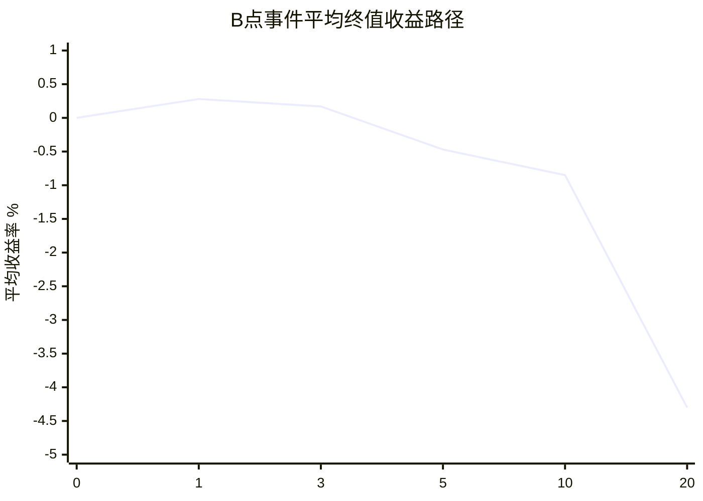
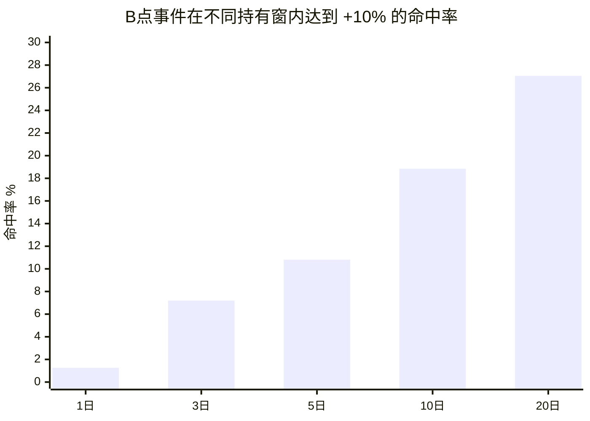
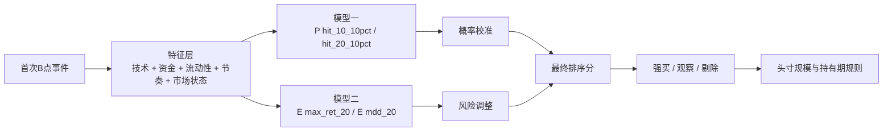
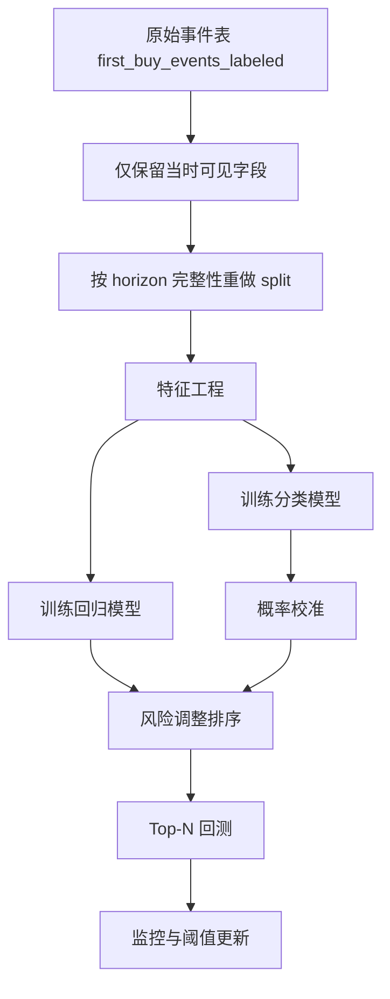

# Chenyiyun2087 项目买点信号增强深度研究报告

## 执行摘要

我先从指定的 GitHub 仓库 `chenyiyun2087/Chenyiyun2087` 与上传附件同时入手。仓库 README 显示，该项目是一个覆盖 **Sina/Eastmoney 数据采集、ScoreRank 评分、M2~M8 策略评估、实盘跟踪、回测、Web 管理台与调度** 的 A 股量化多模块系统；其中买点增强直接落在 `scoreRank` 评分链路与 `bs_score` 分层逻辑上。上传附件则是仓库里 `scripts/export_signal_enhancement_dataset.py` 导出的专用数据包，目标明确指向“**在已出现 B 点的候选中，提高未来 10/20 日最大涨幅命中率、收益回撤比和最新候选排序质量**”。 fileciteturn10file0L1-L1 fileciteturn6file0L1-L1 fileciteturn0file1L1-L27

基于我对上传 CSV 的重算，当前样本一共有 **905 个首次 B 点事件、407 只股票、时间覆盖 2026-01-22 到 2026-05-08**；10 日标签可用 732 条，20 日标签可用 584 条。样本的核心现象非常鲜明：**B 点之后短线平均并不差，但中期明显走弱**。平均 1 日收益约 **+0.28%**，3 日 **+0.17%**，5 日转为 **-0.47%**，10 日 **-0.85%**，20 日 **-4.30%**；与此同时，20 日窗口内平均最大涨幅仍有 **+7.70%**，但平均最大不利浮亏达到 **-10.68%**。这说明当前 B 点更像是“**有交易机会，但缺乏持有筛选与回撤控制**”的事件流，而不是天然可以长期持有的高胜率信号。附件说明、字段字典和仓库导出脚本都与这一研究口径一致。 fileciteturn0file1L1-L27 fileciteturn0file0L1-L29 fileciteturn6file0L1-L1

当前系统的 `bs_score` 公式是一个**静态线性加权器**：`0.15*score + 0.30*opt_score + 0.25*claude_score + 0.15*s_rs + 0.05*s_breakout + 0.10*entry_timing - risk_penalty`，其中还对涨停和极端涨跌幅做少量惩罚；阈值分层是 `>=75 强确认`、`>=65 可交易`、`>=58 观察`。这套规则的优点是简单、可解释、易部署；但它也天然存在三类问题：**信息重复计权**、**阈值不可自适应**、**只做点估计不做概率校准**。从我对附件的重算看，`bs_score` 与 `opt_score`、`score` 的相关性已经偏高，说明它更像是旧分数的再加权，而不是一套真正的新信号。 fileciteturn12file0L1-L1

最关键的工程问题不是模型，而是**评估协议本身还不够严谨**。导出脚本把 `sample_split` 按事件日期直接切成 train/validation/test，但标签是按未来 1/3/5/10/20 个交易日生成的；结果就是目前附件中的 **test 段几乎没有 10 日/20 日标签**，validation 段 20 日标签也非常少。这会让任何“test 结果”都不可靠。这个问题并不是猜测，而是导出代码本身的切分逻辑决定的：它按日期分桶，而不是按“标签 horizon 完整可得”分桶。 fileciteturn6file0L1-L1

因此，我的结论很明确：**该项目目前最需要的不是继续手调权重，而是把买点增强升级为“两阶段、概率化、风险约束”的排序系统**。具体建议是：先用**可解释基线模型**做“命中概率”与“预期回撤”双目标，再用 **LightGBM/XGBoost** 做非线性交互增强，最后用 **CalibratedClassifierCV** 做概率校准，并把最终排序从“分数越高越买”改成“**命中概率 × 预期上涨 / 预期回撤 × 成本约束**”的风险调整排序。树模型本身在疏 sparse 特征与非线性交互上更擅长，XGBoost 用稀疏感知算法与近似分位点算法提升大规模树学习效率，LightGBM 则用 GOSS 与 EFB 进一步提升训练效率；而概率校准需要独立数据或交叉验证，否则会把训练乐观偏差直接带进分层阈值。 citeturn0search35turn1search13turn1search0turn1search3turn1search7

## 仓库与附件梳理

### 仓库内容与当前评分链路

仓库 README 将项目分为调度层、数据采集层、评分层、策略评估层、实盘与信号层、回测层、展示层七个层次；就本次“买点信号增强”而言，最直接相关的是 `scoreRank/cli/run_daily.py`、`scoreRank/core/scorer.py`、`scoreRank/strategies/technical.py`、`scoreRank/strategies/claude.py`、`scoreRank/core/bs_enhanced_score.py` 和 `scripts/export_signal_enhancement_dataset.py`。README 还明确说明：`scoreRank` 的日频主链路是 **全市场取数 → 技术评分 → Claude 六维评分 → 因子优化分 → 市场增强字段 → `bs_score` 分层 → 落库 `score_rank_daily`**。 fileciteturn10file0L1-L1 fileciteturn13file0L1-L1 fileciteturn15file0L1-L1 fileciteturn17file0L1-L1 fileciteturn27file0L1-L1 fileciteturn12file0L1-L1

`scoreRank/core/scorer.py` 给出了技术分的核心构造方式：从 QFQ 行情构造均线、突破、量比、20 日收益、波动收敛、乖离等特征，再结合 RAW 行情计算流动性和“涨停锁死”等风险项，最后按配置文件中的固定权重合成 `base_score`，再减 `penalty` 得到 `score`。配置文件显示：技术总分里 **突破 0.22、趋势 0.12、量能 0.12、RS 0.12、收敛 0.10、流动性 0.10** 的权重相对更高；低流动性会被强制压分，涨停锁死、停牌、ST、负面新闻会被扣分。 fileciteturn17file0L1-L1 fileciteturn19file0L1-L1

`scoreRank/strategies/claude.py` 则给出第二套独立视角。它把评分拆成 **momentum / value / quality / technical / capital / chip** 六个维度，总分 100 分，来自日线、daily_basic、财务指标、资金流、融资融券和筹码分布等上游表。换句话说，上传附件里虽然没有原始财务与资金流字段，但仓库上游其实已经**具备接入更丰富因子**的能力，目前只是没有把它们完整下发到信号增强数据包。 fileciteturn27file0L1-L1

当前的 `bs_score` 由 `scoreRank/core/bs_enhanced_score.py` 计算，明确使用 `score`、`opt_score`、`claude_score`、`s_rs`、`s_breakout`、`price_change_ratio` 和 `is_limit_up`。这说明它并不是一个训练出来的模型，而是一个**手工融合器**；其含义接近“旧评分体系的再加权 + 价格节奏修正”，不是独立学习出来的买点命中概率。 fileciteturn12file0L1-L1

### 附件文件、数据结构与缺失项

上传附件说明文档列出 7 个核心文件：`first_buy_events_labeled.csv`、`first_buy_price_paths_20d.csv`、`active_b_daily_panel_labeled.csv`、`latest_b_candidates.csv`、`signal_enhancement_dataset.xlsx`、`README_FOR_EXPERT.md`、`DATA_DICTIONARY.md`；样本规模为 **905 条首次 B 点事件、8521 条 B 点有效状态日切片、242 条最新候选**。字段字典把可用特征明确分为“当时可见信号字段”和“未来标签字段”，并明确要求未来收益字段不能作为训练特征。 fileciteturn0file1L1-L27 fileciteturn0file0L1-L29 fileciteturn0file2L1-L1

我对附件的直接读取结果与文档一致：

| 文件 | 行数 | 主要用途 | 关键字段 |
|---|---:|---|---|
| `first_buy_events_labeled.csv` | 905 | 主训练表，一行一个首次 B 点事件 | `score`、`opt_score`、`claude_score`、`bs_score`、`ret_*`、`max_ret_*`、`mdd_*` |
| `first_buy_price_paths_20d.csv` | 905 | 事件后 20 日路径 | `rel_ret_d0` ~ `rel_ret_d20` |
| `active_b_daily_panel_labeled.csv` | 8521 | B 点处于有效状态的日切片 | `is_eligible`、`is_high_risk`、`ret_3/5/10`、`mdd_3/5/10` |
| `latest_b_candidates.csv` | 242 | 最新候选，无未来标签 | 当前分数与候选池字段 |

从“缺什么”看，当前附件有四个明显空缺。第一，没有 **60 日标签**；导出脚本只生成 `1/3/5/10/20` horizon，而且价格路径文件也只到 `d20`，所以本轮无法基于附件直接完成 60 日收益与回撤分析。第二，没有 **行业/板块/主题热度** 字段，难以识别“题材共振”。第三，没有下发 **原始财务、资金流、筹码、换手、市值**，虽然仓库上游已经能算，但数据包里只保留了 `claude_score` 和 `opt_score` 的结果，不保留分维原子特征。第四，没有 **交易成本、滑点、撮合可买性** 的字段，因此任何“实盘可执行性”都需要在回测阶段另行建模。导出脚本表明 forward return 使用的是 `tushare_stock.dwd_stock_daily_standard.adj_close`，但 corporate action 的具体处理逻辑并未在附件中单独说明，因此只能视为“由上游复权表隐含处理”。 fileciteturn6file0L1-L1 fileciteturn0file1L1-L27 fileciteturn0file0L1-L29

作为一个小但重要的工程细节，字段字典已经提醒：CSV 被 Excel 打开时优先使用 `ts_code`，避免前导 0 丢失。我在直接读取 CSV 时也确实观察到 `symbol` 很容易被当成数值列，所以后续工程实现里应统一把 `symbol` 存成字符串，并在任何 Excel 导出中优先展示 `ts_code`。 fileciteturn0file0L1-L13

## 数据探索与现状诊断

### 样本收益分布与事件路径

以下统计均为我基于上传的 `first_buy_events_labeled.csv` 与 `first_buy_price_paths_20d.csv` 重新计算，字段口径来自附件说明与字段字典。 fileciteturn0file1L1-L27 fileciteturn0file0L1-L29

| Horizon | 可用样本 | 平均终值收益 | 平均窗口最大涨幅 | 平均窗口最大回撤 | +10% 命中率 |
|---|---:|---:|---:|---:|---:|
| 1 日 | 871 | +0.28% | +1.25% | -0.97% | 1.26% |
| 3 日 | 819 | +0.17% | +2.82% | -2.47% | 7.20% |
| 5 日 | 777 | -0.47% | +3.77% | -3.79% | 10.81% |
| 10 日 | 732 | -0.85% | +5.57% | -5.95% | 18.85% |
| 20 日 | 584 | -4.30% | +7.70% | -10.68% | 27.05% |

这张表是整个项目最重要的现实约束：**B 点不是“买入后自然上涨”的信号，而是“给你一个可能出现冲高的窗口”，但如果不做后续筛选、择时确认与风控，持有到 20 日的平均终值收益会明显回吐。**





可以把这个现象概括成一句话：**当前系统更适合做“机会排序 + 交易管理”，而不适合做“见 B 就长期持有”**。这也是为什么单独再调 `bs_score` 权重，很难从根本上解决问题；必须把“上涨概率”和“回撤风险”同时建模。

### 哪些特征真的有用

我对所有“事件当时可见”的数值特征做了与未来收益/命中率的相关性重算。就 **20 日窗口最大涨幅** 和 **20 日内 +10% 命中率** 来看，当前最有信息量的特征并不是 `score` 本身，而是：

| 目标 | 更有效的现有特征 | 现象解释 |
|---|---|---|
| `max_ret_20` | `s_rs`、`s_liquidity`、`s_breakout`、`bs_score` | 强势股、流动性更好、突破质量更高的标的，更容易在未来 20 日内出现更高最高点 |
| `hit_20_10pct` | `s_liquidity`、`s_rs`、`s_breakout`、`sell_points_count`、`bs_score` | 真正与“打到 +10%”更相关的是相对强弱、流动性和突破，不是总分本身 |
| `ret_5/ret_10` | `s_breakout`、`opt_score`、`claude_score` 有正向信息，但整体不强 | 说明短线有一定边际，但噪声仍很大 |
| `score` | 对 `ret_5` 甚至呈弱负相关 | 说明“技术总分高”不等于“首次 B 点后的未来收益高” |

这几个结果很关键。它表明增强方向不应再执着于把 `score` 调得更精致，而是要把 **RS、突破质量、流动性、节奏确认、风险约束** 提升到更核心的位置，并且要允许这些特征之间产生非线性交互。

另一个有意义的发现是：`claude_score` 的桶间单调性比 `score` 更好。按五分位重算，`claude_score` 最高分组的 20 日 +10% 命中率明显高于最低分组，而 `score` 的分组表现更不稳定。这说明多维因子视角本身是有价值的，只是当前附件没有把 `ClaudeScorer` 的六个原子维度完全下发出来，造成后续信号增强只能拿“总分”做二次排序，损失了可学习信息。 fileciteturn27file0L1-L1

### 当前分层在样本上为什么不好用

从附件重算看，`first_buy_events_labeled.csv` 里 `pool_type` 大部分是空值，只有极少数是 `TRADE/WATCH`。这不是数据错误，而是因为当前仓库的分层逻辑是在 `run_daily.py` 里按 `bs_score` 阈值做业务池分类，而首次 B 点样本又只覆盖“首次出现当日”；于是 `pool_type` 在训练样本中并不适合直接当作可学习特征或评估切面。仓库代码也明确表明：`TRADE` / `WATCH` 是业务标签，不是策略标签。 fileciteturn13file0L1-L1

更严重的问题来自 `sample_split`。导出脚本把全体事件先按日期切成 `train / validation / test`，再给每个事件打未来 1/3/5/10/20 交易日标签。由于 test 段位于时间尾部，它天然还没走完 10 日或 20 日窗口，所以当前附件里 **test 段几乎没有 10 日和 20 日标签**。如果不重做 horizon-aware split，任何“test 命中率提升了多少”的实验结论都会失真。这个问题我建议视作 P0。 fileciteturn6file0L1-L1

## 当前评分体系的主要问题

### 规则层问题

当前 `bs_score` 的结构性问题，在代码层已经很清楚。

第一，它是**静态线性加权**。这意味着 `score`、`opt_score`、`claude_score`、`s_rs`、`s_breakout` 的边际贡献被假定为全局恒定；但真实市场里，“高 RS + 高流动性 + 温和突破”与“高 RS + 低流动性 + 涨停锁死”显然不是同一种局面。线性模型无法自然表达这种交互。 fileciteturn12file0L1-L1

第二，它存在**重复计权**。`score` 里已经包含趋势、突破、量能、RS、收敛、流动性；`claude_score` 里又含 momentum / technical / capital / chip；`opt_score` 里再含 technical / momentum / capital / chip 分类因子。然后 `bs_score` 又额外把 `s_rs`、`s_breakout` 再拿一次。这样做不是一定错，但如果没有训练验证，很容易形成“同一信息被重复奖励”的现象。仓库 README 与各评分代码共同证明了这种重叠结构。 fileciteturn10file0L1-L1 fileciteturn17file0L1-L1 fileciteturn27file0L1-L1 fileciteturn12file0L1-L1

第三，它的 `entry_timing_score` 主要依赖 `price_change_ratio`，而在首次 B 点样本中这个字段大多数接近 0。也就是说，当前 `bs_entry_score` 在训练样本上的有效信息其实有限，很难承担“节奏确认器”的角色。更合理的做法应当是引入 **买点后 1~3 日确认形态**、是否放量不涨停、是否缩量回踩不破位、是否继续站上 MA20/前高等结构特征，而不是只看“离买点涨了几个点”。 fileciteturn12file0L1-L1

### 数据与评估层问题

本次研究里，我认为有五个比“模型选型”更危险的问题。

其一是**类不平衡**。如果目标是 `hit_10_10pct`，阳性样本只占大约 19%；若看 `hit_20_10pct`，也只有大约 27%。这类数据如果直接优化 Accuracy，模型会自然学成“少选股、少出手”的保守器，而不是真正的排序器。

其二是**标签视窗不完整造成的伪测试集**。上面已经说过，当前 `sample_split` 不适合直接做 10 日/20 日 test 评估。这个问题会让“validation 看起来不错、test 无法验证”的情况反复出现。

其三是**时间错配**。导出脚本当前做的是“事件日收盘之后，按事件日可见特征做标签”。如果未来要实盘用于次日开盘买入、盘中买入、或收盘后挂单，那么标签和成交价口径必须与交易时点一致，否则就会出现“收盘可见、盘中不可见”的伪优势。 fileciteturn6file0L1-L1

其四是**生存者偏差与样本窗过短**。当前附件只覆盖 2026-01-22 到 2026-05-08，窗口不足 4 个月，且市场风格单一；这不足以证明一个增强分能跨风格稳定工作。

其五是**特征泄漏风险需要制度化防守**。附件 README 已经写明：`ret_* / max_ret_* / mdd_* / hit_* / days_to_*` 只能做标签不能做特征。建议把这条规则做进训练脚本白名单，而不是只写在文档里。 fileciteturn0file1L1-L27

### 市场规则层问题

A 股不同板块的涨跌幅限制并不相同。上交所长期规则口径为普通股票 **10%**，深交所创业板在特别规定下为 **20%**，北交所为 **30%**。仓库优化清单也曾明确指出，固定把涨停阈值写成 9.5%/9.7% 会对创业板、科创板、北交所产生误判，后来才做了动态修复。买点增强如果继续“主板思维”推所有股票，必然扭曲 `is_limit_up`、突破力度、可买性与次日延续性判断。 citeturn2search0turn2search36turn2search13 fileciteturn5file0L1-L1

## 信号增强优化方案

### 总体设计思路

我建议把当前“单一增强分”改造成 **双阶段、双目标、概率化** 的体系：



这套结构比“继续调权重”更合理，因为它把问题拆成了两个本质不同的子问题：**能不能冲出来**，以及**冲出来之前会不会先把你洗掉**。单一回归分数很难同时兼顾这两个目标。

### 特征工程建议

最优先的是把仓库里已经有、但当前附件没完整下发的能力补齐。

首先，建议保留现有特征，但增加以下 **交互与派生特征**：

| 类别 | 建议特征 | 作用 |
|---|---|---|
| 评分分歧 | `score` vs `claude_score` vs `opt_score*10` 的差值、方差、最大最小差 | 识别“技术热但基本面弱”或“基本面强但技术未启动” |
| 节奏确认 | `price_change_ratio` 分桶、`is_limit_up`、`sell_points_count`、是否买点后次日仍站上 MA20 / 前高 | 把“可买”和“追高”区分开 |
| 组合交互 | `s_rs × s_liquidity`、`s_breakout × s_volume`、`s_contraction × s_breakout` | 捕捉“强势 + 可交易 + 真突破”的组合状态 |
| 风险特征 | `penalty>0`、ST 标记、涨停锁死、停牌近似、买点后过热惩罚 | 提前打掉不可执行或易大回撤样本 |
| 历史上下文 | `event_seq_for_symbol`、同股过去 N 次 B 点表现聚合 | 区分“第一次触发”与“反复触发失效” |

其次，建议把 `ClaudeScorer` 的六个原子维度向下游开放，而不是只给 `claude_score` 总分。这样模型就可以学习“**价值低但动量强**”和“**质量高但资金弱**”之间的差别。仓库代码已经具有这些维度，只差数据集落盘。 fileciteturn27file0L1-L1

再次，建议从上游数据库补充最少一组 **市场状态特征**：指数 5/20 日趋势、行业相对强弱、板块热度、换手率、自由流通市值、融资净买入、主力资金净流入、筹码获利盘、龙虎榜/涨停家数等。仓库本身已经会访问 daily_basic、moneyflow、margin_detail、cyq_perf 等表，所以补充这些字段并不需要全新基础设施。 fileciteturn27file0L1-L1

### 模型与信号聚合建议

**第一层** 建议先做一个可解释基线：  
使用 **Logistic Regression** 预测 `hit_10_10pct` 和 `hit_20_10pct`。它的价值不在于一定最强，而在于：

- 系数可解释，便于检视是否“重复计权”
- 输出容易直接做概率校准
- 适合做规则替代的第一版上线

**第二层** 建议使用 **LightGBM / XGBoost** 做主排序模型。原因非常直接：树模型比线性加权更能学习“RS、突破、流动性、节奏确认、风险项”的非线性交互；XGBoost 论文强调了稀疏感知和近似分位点学习，LightGBM 论文强调 GOSS 与 EFB 带来的效率优势，这都很适合当前这种特征维度中等、样本量暂时不大但未来会扩展的任务。 citeturn0search35turn1search13

我建议最终不要只训练一个模型，而是做 **三模型集成**：

| 模型 | 目标 | 产出 |
|---|---|---|
| Logistic 回归 | `hit_20_10pct` | 可解释概率基线 |
| LightGBM / XGBoost 分类 | `hit_10_10pct`、`hit_20_10pct` | 主排序概率 |
| 回归模型 | `max_ret_20`、`mdd_20` | 预期收益/风险 |

最终分数可以写成：

```text
enhanced_rank
= 55 * P(hit_20_10pct)
+ 20 * P(hit_10_10pct)
+ 15 * z(E[max_ret_20])
- 20 * z(|E[mdd_20]|)
-  5 * turnover_penalty
```

然后再映射到 0~100 标尺。

### 概率校准、阈值与头寸管理

当前项目如果继续输出一个 0~100 的分数，建议不要再让 58/65/75 这类阈值固定死，而应该让阈值对应**概率语义**。例如：

| 分层 | 概率口径示例 | 交易含义 |
|---|---|---|
| 强买 | `P(hit_20_10pct) >= 0.42` 且 `E[max_ret_20] / |E[mdd_20]| >= 1.3` | 可进入 Top-N 组合 |
| 观察 | `0.28 <= P(hit_20_10pct) < 0.42` | 等待确认或缩量回踩 |
| 剔除 | `< 0.28` 或风险约束不满足 | 不买 |

这里的关键不是具体阈值，而是**阈值必须从 walk-forward validation 上学出来**，不是拍脑袋写死。

为什么我特别强调校准？因为排序分数和可解释概率不是一回事。scikit-learn 的文档明确说明，概率校准应该建立在独立于原始训练过程的数据或交叉验证上，否则会把训练集上的乐观偏差带入概率；文档同时指出 `CalibratedClassifierCV` 可以用交叉验证完成这种无偏校准，而 isotonic 在样本太少时容易过拟合。对于你当前 905 条事件样本的规模，这一点尤其重要。 citeturn1search0turn1search3turn1search7

头寸管理方面，我建议采用“**风险调整等权**”而不是“分数最高全买”：

```text
position_weight_i
∝ P(hit_20_10pct)_i / max( |E[mdd_20]|_i , floor )
```

再加上单票上限、行业上限、板块上限和成交额约束。这样可以避免高分但流动性差、回撤大的小票挤占过多权重。

## 可复现实验与工程落地

### 训练与回测流程

建议把实验流程严格写死，形成一个可复现的 pipeline：



建议的协议如下：

| 环节 | 建议 |
|---|---|
| 数据预处理 | 所有 `symbol/ts_code` 强制字符串化；未来标签全部从白名单特征中剔除；新增缺失值报告 |
| 切分 | 按目标 horizon 重做 split，例如“仅在 `ret_20` 非空的样本中做 train/val/test” |
| 交叉验证 | 采用 walk-forward；训练窗口向前滚动，验证/测试窗口严格在后 |
| 成本模型 | 加入双边佣金、印花税、最少 10~30bp 滑点敏感性分析 |
| 排名评估 | `precision@k`、AUC、AP、Brier、Top-N 平均 `max_ret_20`、平均 `mdd_20`、收益回撤比、换手率 |
| 组合评估 | Equal-weight Top-10 / Top-20 / Top-30 的净值、Sharpe、最大回撤、胜率 |

### 方法比较表

| 方案 | 优点 | 缺点 | 计算需求 | 适用阶段 |
|---|---|---|---|---|
| 规则增强版 `bs_score_v2` | 最易解释，最快上线 | 上限有限，难学交互 | 低 | 立刻可做 |
| Logistic 概率模型 | 可解释、稳健、易校准 | 非线性交互能力弱 | 低 | 第一阶段基线 |
| LightGBM / XGBoost | 非线性强、排序能力强 | 需调参与防过拟合 | 中 | 主力模型 |
| 双头模型 `hit + max_ret/mdd` | 直接对应交易目标 | 工程复杂度更高 | 中 | 第二阶段 |
| Active panel 持有期模型 | 能解决“何时加减仓/卖出” | 需要额外时序设计 | 中高 | 第三阶段 |

### 关键超参数建议

**Logistic Regression**

- `C`: 0.05, 0.1, 0.3, 1.0  
- `class_weight`: `balanced`
- 特征先做 rank-normalize 或 z-score

**LightGBM / XGBoost**

- `max_depth`: 3, 4, 5
- `num_leaves`: 15, 31, 63
- `learning_rate`: 0.02, 0.05, 0.1
- `min_data_in_leaf`: 20, 40, 80
- `subsample`: 0.7, 0.85, 1.0
- `colsample_bytree`: 0.6, 0.8, 1.0
- `scale_pos_weight`: 按阳性比例自动设定

**校准**

- 样本少时优先 `sigmoid`
- 样本充分后比较 `sigmoid` vs `isotonic`
- 校准集必须与训练集时间隔离，或用 `CalibratedClassifierCV` 交叉验证完成。 citeturn1search0turn1search3turn1search7

### SQL 与伪代码

如果要把 60 日标签补齐，最实用的不是手工导出，而是在上游数据库直接扩 horizon。导出脚本当前只做 1/3/5/10/20，因此你需要把 horizon 扩到 60，并用复权收盘价计算。 fileciteturn6file0L1-L1

```sql
WITH px AS (
    SELECT
        SUBSTR(ts_code, 1, 6) AS symbol,
        trade_date,
        adj_close,
        LEAD(adj_close, 1)  OVER (PARTITION BY ts_code ORDER BY trade_date)  AS close_1,
        LEAD(adj_close, 5)  OVER (PARTITION BY ts_code ORDER BY trade_date)  AS close_5,
        LEAD(adj_close, 10) OVER (PARTITION BY ts_code ORDER BY trade_date)  AS close_10,
        LEAD(adj_close, 20) OVER (PARTITION BY ts_code ORDER BY trade_date)  AS close_20,
        LEAD(adj_close, 60) OVER (PARTITION BY ts_code ORDER BY trade_date)  AS close_60
    FROM tushare_stock.dwd_stock_daily_standard
),
evt AS (
    SELECT event_date, symbol, event_uid
    FROM your_first_buy_events
)
SELECT
    e.event_uid,
    e.event_date,
    e.symbol,
    (p.close_1  / p.adj_close - 1) AS ret_1,
    (p.close_5  / p.adj_close - 1) AS ret_5,
    (p.close_10 / p.adj_close - 1) AS ret_10,
    (p.close_20 / p.adj_close - 1) AS ret_20,
    (p.close_60 / p.adj_close - 1) AS ret_60
FROM evt e
JOIN px p
  ON p.symbol = e.symbol
 AND p.trade_date = DATE_FORMAT(e.event_date, '%Y%m%d');
```

训练伪代码建议这样写：

```python
feature_cols = visible_feature_whitelist()
target = "hit_20_10pct"

df = load_events()
df = df[df[target].notna()].sort_values("event_date")

train, val, test = horizon_aware_split(df, target)

X_train, y_train = train[feature_cols], train[target]
X_val,   y_val   = val[feature_cols],   val[target]
X_test,  y_test  = test[feature_cols],  test[target]

base_model = LGBMClassifier(
    max_depth=4,
    num_leaves=31,
    learning_rate=0.05,
    min_child_samples=40,
    subsample=0.8,
    colsample_bytree=0.8,
    objective="binary"
)

base_model.fit(X_train, y_train)
cal_model = CalibratedClassifierCV(base_model, method="sigmoid", cv=5)
cal_model.fit(pd.concat([X_train, X_val]), pd.concat([y_train, y_val]))

test["p_hit20"] = cal_model.predict_proba(X_test)[:, 1]

# 第二头：回归 max_ret_20 / mdd_20
up_model.fit(X_train, train["max_ret_20"])
dd_model.fit(X_train, train["mdd_20"].abs())

test["rank_score"] = (
    55 * test["p_hit20"]
    + 15 * zscore(up_model.predict(X_test))
    - 20 * zscore(dd_model.predict(X_test))
)
```

## 优先级清单与限制

### 最优先的落地顺序

我建议按照下面顺序推进，而不是先上复杂模型。

首先，修复数据协议。把 **horizon-aware split**、特征白名单、缺失值检查、标签完整性检查做成硬约束；这一步不做，后面所有提升都不可信。

其次，做一版 **`bs_score_v2` 规则增强版**。不用等机器学习，也能先把当前公式升级为“RS、流动性、突破质量、节奏确认、风险约束”的更合理组合；同时把输出从 0~100 分映射到 `强买 / 观察 / 剔除` 三档。

再次，上 **Logistic + 校准** 作为第一版可解释概率模型。它不一定最强，但最适合做现网替换与结果审计。

然后，再上 **LightGBM/XGBoost 双头模型**。这一步的目标不是“抬一点 AUC”，而是把 **Top-N 命中率、Top-N 最大涨幅、Top-N 平均回撤** 明显拉开。

最后，利用 `active_b_daily_panel_labeled.csv` 做 **持有期与卖出期增强**。因为从当前样本看，真正的短板其实不只是“选谁买”，而是“买了以后怎么不把利润回吐掉”。 `active_b_daily_panel_labeled.csv` 正是研究加减仓和退出时机的天然素材。 fileciteturn0file1L1-L27

### 工程实施与监控检查表

工程上建议至少监控这些项目：

- 每日事件数、缺失率、标签可用率
- `score / opt_score / claude_score / bs_score_v2 / p_hit20` 的分布漂移
- Top-10 / Top-20 / Top-30 的命中率、平均 `max_ret_20`、平均 `mdd_20`
- 板块分层表现：主板 / 创业板 / 北交所
- 市值与流动性分层表现
- 实盘成交率、滑点、买不到比例
- 校准曲线与 Brier score
- 模型输入异常告警与任务失败告警

### 开放问题与限制

本轮报告也有边界，我建议明确记录。

第一，**附件没有 60 日价格路径，仓库导出脚本也只生成到 20 日**，所以我没有对 60 日 horizon 做实证统计，只给出了如何在上游补齐的方法。 fileciteturn6file0L1-L1

第二，当前附件窗口只覆盖 **2026 年 1 月到 5 月**，样本时段短、市场风格单一，结论适合做“当前阶段优化方向”，不适合直接当作长期稳定性证明。 fileciteturn0file2L1-L1

第三，当前 supplied `sample_split` **不适合直接给 10 日/20 日目标做 test 评估**；如果不先修复这一点，就不应该对外宣称“test 提升了多少”。

第四，A 股板块涨跌幅制度不同，主板 10%、创业板 20%、北交所 30%，这要求所有“涨停”“锁死”“可买性”逻辑都必须分板块建模，而不是一个阈值走天下。 citeturn2search0turn2search36turn2search13

综合来看，我对这个项目的判断是：**方向是对的，数据也足够开始做增强，但当前真正的瓶颈不是“再调几分权重”，而是把评分体系从静态再加权，升级成概率化、风险约束、时序验证完备的排序系统。** 只要先把 split、标签、特征下发和校准这四件事做扎实，`Chenyiyun2087` 的 B 点增强分就有机会从“主观权重分”升级成“可验证、可部署、可持续迭代”的交易信号系统。