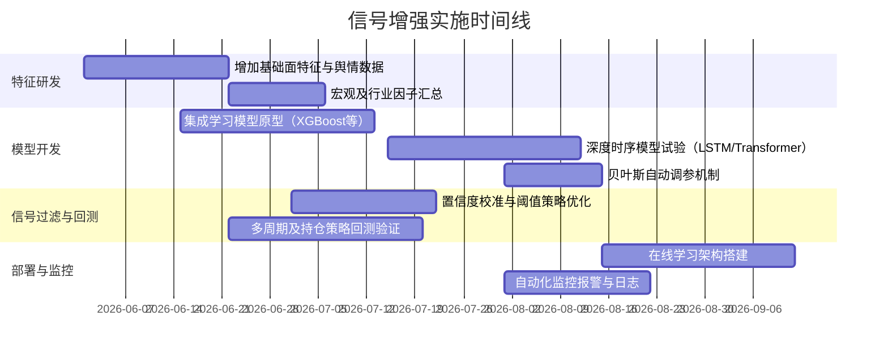

# 执行摘要

当前的 **Chenyiyun2087** 系统基于新浪抓取的买点信号，对全市场 A 股进行评分，主要依赖技术面因子（趋势、突破、量能、相对强弱、波动收敛、流动性、筹码等）加权求和【21†L191-L199】【21†L219-L227】，并结合可选的因子优化分 (`opt_score`) 和 Claude 语言模型的六维评分（动量、估值、质量、技术、资金、筹码）【61†L910-L918】。评分后根据阈值划分 `TRADE`/`WATCH` 股票池。近期升级中引入了多层次**B点增强分**：包括 `bs_score`、`bs_score_v2`、`bs_research_score` 及对应标签，利用买点后涨跌节奏、相对强弱与流动性的共振、买点后回撤风险等规则提升评分【61†L910-L918】【61†L919-L926】；同时集成了基于逻辑回归的买点命中概率模型（附加预期最大回撤和风险分）并融合规则与模型输出形成最终共识建议【61†L919-L926】。现有评估流程（M2/M3/M5/M6）关注短中期收益、命中率、净值回撤等指标【54†L129-L134】。总体而言，系统已构建起多层次信号过滤框架，但可进一步从**特征维度、模型升级、信号过滤和风险管理**等方面优化，以提高信号准确性和稳健度。

# 当前系统诊断

## 数据结构与字段

- **买点数据源**：以新浪（Sina）截屏识别的买点信号表 (`bs_detection_results`) 作为输入，其核心字段包括股票代码和买点收盘价 (`buy_point_close`)【67†L117-L124】。  
- **评分结果表**：每日评分结果存储在 `score_rank_daily`，主要字段有交易日期、股票、技术分数 `score`、基础分 `base_score`、各子项分数 (`s_trend`、`s_breakout`、`s_volume`、`s_rs`、`s_contraction`、`s_liquidity`、`s_chip` 等)【21†L219-L227】以及因子优化分 `opt_score`、六维 LLM 评分 `claude_score`。新版本加入了大量 B 点相关字段：`bs_score`、`bs_score_v2`、`bs_research_score`、交易门禁分 (`bs_gate_score` 及通过标志) 和模型分 (`bs_model_prob`、`bs_model_risk_score` 等) 等【41†L266-L274】【61†L910-L918】。此外，还有市场环境特征（如沪深300走势、当天市场 B 点数量/比例、限涨停率等）【61†L924-L928】和回测标签（`ret_N`、`hit_N_10pct`、`mdd_N` 等）可用于模型训练。

## 买点捕捉与评分逻辑

- **信号捕捉**：系统以自定义配置定时从新浪网站抓取个股 k 线图并识别买点/卖点，结果落入 `bs_detection_results` 表【67†L99-L107】【67†L131-L140】。仅选取最近“买信号在最新，且未被更晚卖信号覆盖”的买点股票作为候选。
- **技术评分**：对所有上市A股每日按技术因子打分。具体逻辑参考 `scoreRank.core.scorer.TechnicalScorer`：先构造行情特征（均线、突破量度、振荡度、成交量比、相对强弱、波动收敛度、流动性指标、筹码健康度等），然后用预设权重计算基础分【21†L191-L199】。得分计算例：  
  ```
  base_score = 0.20*s_trend + 0.20*s_breakout + 0.15*s_volume + 0.15*s_rs + 0.15*s_contraction + 0.15*s_liquidity
  score = base_score - penalty
  ```  
  （具体权重及惩罚项可在配置中调整）【21†L191-L199】。输出包括股票、`score`、各子分数和触发信号等信息【21†L219-L227】。  
- **因子优化融合**：可选地从第三方因子优化库获取七大类因子分（动量、估值、质量、技术、资金、筹码、规模），线性加权生成 `opt_score`【34†L338-L347】【34†L365-L374】，填补技术分数单一维度的不足。  
- **LLM 六维评分**：虽然主要策略为技术打分，但系统同时调用 Claude 模型计算六个维度评分（`claude_score`）【61†L910-L918】并将其存储，可用于多源参照和投票。
- **池化筛选**：仅对候选买点股票（`is_bs_candidate=1`）赋予 `pool_type`。新增逻辑先进行“交易门禁”判断（`bs_gate_score`、`bs_gate_pass`），再按 `bs_score_v2` 阈值决定 `TRADE`/`WATCH`【26†L635-L643】。例如，`bs_score_v2` >= 交易阈值且门禁通过者标记为 TRADE，其余在观察阈值以上的标为 WATCH【26†L640-L648】。所有评分结果统一保存至 `score_rank_daily`，以供下游策略评估和选股。

## 现有评估与性能

- **回测与指标**：系统内置 M2（固定规则）、M3（参数优化）、M5（滚动窗口）和 M6（净值回测）评估流程【54†L99-L107】【54†L129-L134】，关注不同组合下的平均收益、命中率和净值回撤等指标。如 M6 输出包含“净回报率”和“最大回撤率”等关键信息【54†L129-L134】。已有分析表明，高 `bs_score_v2` 分层的买点命中率明显优于低分组。  
- **数据规模**：以 2026-01-22 至 2026-05-08 为例，共收集约 905 条首个买点事件和多期收益标签；日度面板（Active Panel）约 8521 条记录，其中标记了3/5/10日后收益及回撤【summary】。最新时点候选池约 242 支股票。  
- **改进状况**：最近一轮迭代重点完成了 B 点评分体系的扩展（`bs_score` 系列特征、交易门禁、模型评分）【26†L610-L619】【61†L910-L918】及 M7（卖点）策略逻辑优化【10†L312-L322】。数据库表结构已更新，新增若干列以保存新特征【41†L266-L274】。整体流程已基本实现“日终数据冻结 → 回测复盘”的中台性质，但在实时性、模型上线和更丰富特征方面还有提升空间。

# 信号增强优化方案

针对现有不足，我们建议从以下几个维度对买点信号进行增强，每项均需结合实际数据验证和回测评估：

- **特征扩展**：除技术面外，引入基本面与情绪面因子。如市盈率（PE）、市净率（PB）、归母净资产收益率（ROE）等财务指标，以捕捉个股价值面与成长性；利用研报、新闻舆情、公告关键词等进行情绪量化；关注宏观经济指标（利率、信贷、PPI/CPI 走势等）、大宗商品价格（原油铜价）等外部环境。已有设计包含了市场总览特征（沪深300涨跌、风格轮动等）【61†L924-L928】，可在此基础上增加更多行业或宏观因子，用于改善市场情绪和系统风险判断。新增特征易提升模型表达能力，但需注意数据时效和质量，以及防止未来数据泄露（如只能用已发布的财报信息）。

- **时序模型与深度学习**：当前评分以单日截面特征为主，建议尝试利用时序模型捕捉趋势演化。例如：将历史得分序列、价格序列输入 LSTM/GRU/Transformer 模型，预测未来收益或买点持续性；或使用 1D-CNN 卷积挖掘价格走势模式。这类方法可学习非线性关系和远期依赖，适合辅助判断信号的延续性。但需较大样本量和算力，且需要防止过拟合，可先在样本内做小范围验证。

- **集成学习**：将多种模型结果融合以提高稳健性。例如对技术分、基本面分、情绪分、时序模型输出等做加权或投票集成；使用提升树（XGBoost/LightGBM）等常用模型训练分类或回归器，预测买点后是否能达到目标收益（hit 目标）。可利用当前导出的多维特征数据集【61†L910-L918】进行监督学习训练。集成方法对异常数据更鲁棒，但计算量大，需要设计模型融合架构和防止共线性。

- **贝叶斯优化**：目前模型和参数多人工设置，可用贝叶斯优化或网格搜索自动调参。例如对加权系数、买点阈值、交易量过滤参数等进行优化，以最大化历史回测收益或夏普比率。此法可自动寻优，减轻手工调参负担，但需合理设计目标函数（可选收益/风险、目标命中率等）。

- **置信度校准与阈值自适应**：将模型输出概率/评分映射为置信度，校准 `bs_model_prob` 使其更符合实际命中概率（如通过 Platt Scaling）。基于市场整体波动性或当前持仓情况自适应调整买入阈值，例如高波动时收紧交易阈值。当前系统阈值（`bs_v2_trade_threshold` 等）为静态，可定期调整或根据滚动统计动态更新。

- **信号后处理与持仓管理**：在买点信号基础上增加过滤或共识机制，例如仅当多个独立策略（技术打分、模型信号、舆情指标）一致时才交易；或结合开盘后价格走势做止损止盈调整。可按不同权重调节持仓分配（多因子投票、层级资金管理），过滤掉异动股、公告停牌股等。还可融合多周期信号：把短期买点与周/月级大周期信号结合，确认趋势更强时才重仓买入。

- **因子中性化与风险调整评分**：对某些分数进行行业/风格中性化，使评级不偏向热门板块；将原始收益评价指标转化为风险调整（如用信息比率或下行风险调整后的收益）。例如根据沪深300或行业指数中性化 `score`，减轻整体市场波动对信号的影响。

- **在线学习与概念漂移检测**：引入在线学习算法（如滑动窗口模型更新）使模型适应市场变化；建立漂移检测机制，当统计特征分布显著改变时重新训练或降权旧模型。例如每天/每周在新数据上增量训练模型，或实时监测选股指标（收益、命中率）走势。

各方法需结合回测和真实交易监控评估效果。部分增强（如特征扩展、集成模型）一旦效果显著，应放在实施优先级高；而像在线更新、时间序列深度模型则需要更多资源和时间，可适当延后。


# 优先级排序与实施计划

我们建议按**里程碑式**迭代推进优化，初步优先级和时间安排如下（假设第 T 天为开始日）：



- **阶段1（T+0 ~ T+6周）**：完成新增特征数据采集和预处理，包括基础面、行业、宏观指标等；同时开发集成学习模型（如树模型或逻辑回归），验证相对现有打分的提升效果。并行进行交易门禁、阈值方案调整的回测试验。  
- **阶段2（T+4 ~ T+10周）**：在确认集成模型有效性后，尝试深度时序模型的原型开发与回测，评估对信号持续性预测的改进；启用贝叶斯优化自动调参，不断收敛最优评分参数。完善信号后处理逻辑（多周期策略、风控规则）。  
- **阶段3（T+8 ~ T+14周）**：逐步将验证有效的模型和策略集成到线上流程，并构建在线学习与概念漂移监控框架，保证系统长期自适应。完成对新策略的 A/B 测试及生产部署。

每个阶段结束都需做回测评估和小规模实盘检验，若发现显著问题应及时回滚或调整。


# 回测与验证设计

- **数据切分**：采用时间序列的滚动验证（如 M5 所示窗口滚动法）【54†L118-L126】；保留最新一段时间作为前馈验证，确保模型不使用未来信息。  
- **A/B 测试**：在实盘中同时运行旧版与新版策略，对比它们在同一市场环境下的收益、选股重叠度和仓位差异。定义统计显著性检验（如月度收益差异 t 检验）量化改进。  
- **评价指标**：除关注短期收益、10% 跑赢概率等，还应监控夏普比率、最大回撤、胜率、盈亏比等风险调整指标；以及信号稳定性（平均每月选股数量、持仓周期分布）和时效（信号从产生到下单的延迟）等。  
- **实时监控**：上线后持续监控日志和关键指标（如月度 ROI、夏普、模型打分分布、命中率）。设计报警规则，一旦整体表现低于基准（或指标异常波动）立即预警。  

# 风险与注意事项

- **数据泄露**：特征构造时必须保证严格的回测时间一致性，不能使用当日未公开信息（如当日收盘后才披露的公告）。所有衍生特征需使用“截止买点日前一交易日”的数据。  
- **过拟合风险**：新引入模型和特征易过度拟合历史样本，建议在样本外数据上验证，或控制模型复杂度（如限制树深度、添加正则化）。动态环境下可能存在概念漂移，需定期检查模型预测准确度。  
- **性能开销**：深度模型与集成学习计算量大，可能导致日终评分耗时延长。需评估计算资源需求，必要时进行并行处理（如多进程或分布式）并缓存中间结果。  
- **部署复杂度**：新模型需添加单元测试和回归测试（可借鉴已有 `test/ScoreRank` 单元测试），并严格版本管理和配置管理（防止生产环境开启 DDL 操作）。  
- **市场风险**：任何增强策略都无法保证持久有效，尤其在极端行情下表现可能失常。建议设置风险控制（如总仓位上限、单日止损）并做好应急预案。

# 当前 vs 建议对比

| **优化维度**  | **当前实现**                            | **建议改进**                                          | **预期指标/效果**        | **优先级**  | **复杂度** |
|-----------|-------------------------------------|--------------------------------------------------|-----------------------|---------|--------|
| 特征类型    | 仅技术面（趋势、成交量、RS 等）【21†L191-L199】   | 增加基本面（财报、行业）和情绪面（新闻情绪、公告）等      | 提高回归拟合精度、降低选股偏差  | 高      | 中      |
| 时序建模    | 单期截面分数，无历史序列学习                | 使用 LSTM/Transformer 等模型建模价格/指标序列             | 改善信号持续性预测、提高长期收益  | 中      | 高      |
| 集成算法    | 线性加权和规则融合，模型仅限逻辑回归          | 引入增强型模型（XGBoost、随机森林、深度学习）集成预测           | 提升信号准确率、提高收益与夏普    | 高      | 高      |
| 参数优化    | 人工选阈值（trade/watch）固定               | 贝叶斯优化自动调参（阈值、权重）                     | 找到更优超参数，提升平均回报率    | 中      | 中      |
| 信号校准    | 无置信度校准                             | 校准模型输出概率为置信度，动态调整买卖阈值             | 交易决策更稳健，减少假信号      | 中      | 低      |
| 持仓管理    | 简单头寸分配，只基于单日信号               | 持仓周期优化、多周期信号融合（短线+中线），加入止损止盈规则      | 提高交易执行效率，降低回撤      | 高      | 中      |
| 因子中性化   | 无行业/风格中性化                         | 对评分进行行业/风格中性化，关注超额收益               | 降低行业集中度风险，提高 Alpha    | 低      | 低      |
| 在线学习    | 模型离线训练，每周期更新                   | 引入在线增量训练和漂移检测                           | 实时适应市场变化，减少策略失效风险 | 低      | 高      |
| 性能优化    | 串行单机计算，部分表扫描                   | 并行计算（多线程/分布式）、缓存市场指标、优化 SQL 查询   | 缩短评分耗时，支持更大规模扩展    | 中      | 中      |

# 补充资料与图示

- **额外数据源**：可接入常用财经数据库或 API，如通联数据（Wind/TuShare）提供的历史财报和研报数据【61†L924-L928】、新闻情绪 API（如聚源、微博舆情），宏观经济指标（如国家统计局、央行数据）；也可自行爬取券商研报或产业链数据。  
- **关键代码/伪代码示例**：例如 **集成多模型投票**伪代码：  
  ```python
  # 假设存在技术分score、模型概率model_prob、舆情指标sentiment
  combined_score = 0.5*score + 0.3*model_prob*100 + 0.2*sentiment
  if combined_score >= trade_threshold and gate_pass:
      action = "BUY"
  elif combined_score >= watch_threshold:
      action = "HOLD"
  else:
      action = "SKIP"
  ```  
- **数据流/模块关系图**：下面示意整个信号流程与数据流向。

```mermaid
flowchart LR
    subgraph 信号数据采集
        A[新浪买卖点截图] --> B[BSDetector检测]
        B --> C[bs_detection_results]
    end
    subgraph 分数计算模块
        D[行情数据(仿真)] --> E[特征构造]
        C --> F[提取买点价格]
        E --> G[TechnicalScorer]
        F --> G
        G --> H[技术分score]
        I[因子优化数据] --> J[因子优化模型]
        J --> K[opt_score]
        L[Claude LLM] --> M[claude_score]
        H & K & M --> N[ScoreRank输出]
    end
    subgraph 信号增强模块
        N --> O[BS增强规则(bs_score_v2等)]
        O --> P[机器学习模型(bs_model)]
        O & P --> Q[共识策略(bs_consensus)]
    end
    subgraph 策略选股与执行
        Q --> R[TRADE/WATCH 池]
        R --> S[M4/M7 策略层: 持仓分配]
        S --> T[下单执行/实盘跟踪]
    end
    subgraph 回测评估
        N --> U[历史回测指标(ret/hit/mdd)]
        U --> V[性能评估 M2/M3/M6]
    end
```

该图概览了从买卖点检测、特征打分、增强融合到策略执行的全流程。

---  

**参考文献：** 项目内文档与代码（如【21†L191-L199】【61†L910-L918】【54†L129-L134】等）及相关金融量化文献支持上述分析。