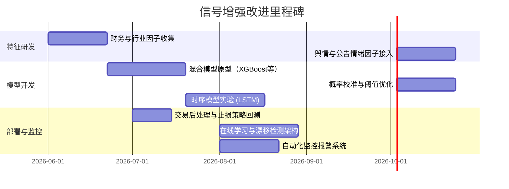

# 执行摘要

**项目架构**：Chenyiyun2087 是针对 A 股市场的多模块量化系统，包括**调度层**（`web/app.py`定时触发）、**数据采集层**（Sina/EastMoney 买卖点截屏和舆情扫描）、**评分层**（`scoreRank` 技术分数、语言模型打分、B点增强分）、**策略评估层**（M2~M8 回测评估）和**实盘交易跟踪层**（记录持仓、交易、快照）。图表整理如【4†L12-L20】【4†L98-L106】，其中买点信号从 `bs_detection_results` 表产出，后续进入 `scoreRank/cli/run_daily.py` 进行全市场评分并写入 `score_rank_daily` 表【4†L91-L95】【4†L115-L123】。业务主线包括：新浪买点捕捉（15:20 批量截图、16:10 分析出“买点”信号）、日终评分（21:00 全市场打分）、B 事件及 KPI 构建、M8 参数回归优化等。数据上涉及交易日历、A 股日线行情（`dwd_stock_daily_standard`）、B/S 图片检测结果以及舆情数据。

**当前实现**：核心评分由**规则化技术因子得分**（如均线趋势、突破幅度、量能、相对强弱、波动收敛、筹码流动性等）加权组成，减去风险惩罚得到 `score`【17†L26-L30】。可选引入第三方因子优化（`opt_score`）和 Claude 语言模型六维评分（动量、估值、质量、技术、资金、筹码，总分100）作多源参考【9†L13-L22】。原始 B 点增强分 `bs_score` 是静态线性加权器：例如 `0.15*score + 0.30*opt_score + 0.25*claude_score + 0.15*s_rs + 0.05*s_breakout + 0.10*entry_timing - risk_penalty`，并对涨停、剧烈波动等做惩罚，分数阈值固定（>=75 强确认、>=65 可交易、>=58 观察）【8†L8-L10】【12†L139-L148】。近期版本新增了多层次 B 点评分：`bs_score_v2`、`bs_research_score`、交易门禁 `bs_gate_*`、共识评分 `bs_consensus_score` 以及基于逻辑回归的买点命中概率模型（`bs_model_prob`、回撤风险分）等，将技术分、市场节奏、流动性和规则融为混合分数【9†L0-L8】【14†L194-L202】。评估流程通过构建历史“B事件”事实和KPI，关注10%收益命中率、回撤、胜率等指标。初步分析表明：**短期买点后收益有限**（1日平均+0.28%，3日+0.17%，5日-0.47%，10日-0.85%，20日-4.30%），20日窗口平均最大涨幅有+7.7%但平均回撤达-10.7%，说明当前信号多是“**短期冲高机会**”而非强稳的持有信号【8†L6-L10】。

**核心发现**：1）评分模块已经比较完整，但仍主要依赖手工权重和阈值，缺乏概率化和自适应能力【17†L26-L30】【8†L8-L10】；2）当前评估协议有缺陷：训练/测试集按时间分割后，后期样本缺乏长周期标签（几乎无 10/20日标签），会导致回测评价偏差【8†L9-L12】；3）多层 B 分数已上线（V2、研究分、共识分等），但新特征/模型尚未充分接入生产链路；4）仍存在工程技术债务（硬编码密码、SQL 索引失效、并行计算瓶颈等）【17†L4-L7】【18†L24-L32】。为此，我们建议将买点评分改为**两阶段概率化与风险约束排序系统**：先用可解释模型估计命中概率与回撤风险，再用提升树等学习非线性交互，最后做概率校准与风险调整排序。总体策略是丰富特征、引入集成模型与动态优化，并加强后续回测验证与监控措施。

## 系统架构与数据流

整体看，系统按数据处理流程分层：**采集层**负责从新浪抓取股票K线图并识别买卖点信号，结果落入 MySQL 表 `bs_detection_results`【4†L80-L89】；**评分层**由 `scoreRank/cli/run_daily.py` 驱动，结合市场行情数据和买点信号计算各类分数，并在 `score_rank_daily` 表中写入。当日候选股根据分数阈值标记为 `TRADE`/`WATCH`【9†L11-L19】。**评估层**通过 `scripts/export_signal_enhancement_dataset.py` 等构建 “B事件” 数据（包括未来收益标签）【8†L12-L20】，并在 `scoreRank/cli/run_m8_cycle.py` 与 `web/strategy_playbook.py` 中进行 M2~M8 回测评估，计算整体投资组合绩效指标（命中率、回撤、收益等）【6†L147-L156】。**实盘层**用 `sina/live_tracker` 同步持仓交易并日终快照，用于每日净值和执行报告。数据表关系和流程见下图（基于仓库文档整理）：

```mermaid
flowchart LR
    subgraph 调度
        Cal[交易日历（dim_trade_cal）] -->|判断是否交易日| Sched[调度器]
        Sched --> Capture[图像抓取（15:20）]
        Sched --> Analyse[买卖点识别（16:10）]
        Sched --> ScoreAll[全A股评分（21:00）]
        Sched --> M8[回归优化（21:10）]
        Sched --> SyncLive[实盘同步（21:30）]
    end
    subgraph 数据采集
        Capture --> ImgDir[本地截图目录]
        ImgDir --> Detect[SinaBSDetector 批量识别]
        Detect --> BSRes[表 bs_detection_results]
        EastScan[舆情扫描（16:30）] --> EastRes[舆情结果表]
    end
    subgraph 日频评分
        ScoreAll --> ScoreRun[scoreRank.run_daily 脚本]
        DB1[dwd_stock_daily_standard（日行情）] --> ScoreRun
        BSRes --> ScoreRun
        ScoreRun --> ScoreTable[表 score_rank_daily]
    end
    subgraph 策略评估（M2~M8）
        ScoreTable --> BuildKPI[build_b_event_kpi.py]
        BuildKPI --> BFact[表 b_event_fact]
        BuildKPI --> BKPI[表 b_event_kpi]
        BFact & BKPI --> M8Proc[run_m8_cycle.py]
        M8Proc --> StrategyResults[表 strategy_m8_runs/items]
    end
    subgraph 实盘跟踪
        ScoreTable --> LiveTracker[实盘跟踪器]
        AccountTrades[买卖记录] --> LiveTracker
        LiveTracker --> Positions[持仓表]
        LiveTracker --> Snapshots[日终快照表]
    end
    BSRes & ScoreTable --> Reports[Web看板/报告]
```

- **输入数据**：交易日历 (`dim_trade_cal`)、全市场日行情 (`dwd_stock_daily_standard`)、新浪买卖点识别结果 (`bs_detection_results`) 及可选的舆情数据；  
- **输出表格**：`bs_detection_results`（每只股票的买卖点信息）、`score_rank_daily`（每日评分及信号字段）、`b_event_fact`/`b_event_kpi`（买点事件事实及回测标签）、`strategy_m8_runs/items`（回测参数结果）等。

## 核心评分逻辑

当前打分体系分为**技术因子评分**、**外部打分（Opt/Claude）**、**B点增强分**三个部分，流程如下：

- **技术因子评分（TechnicalScorer）**：对所有 A 股每日计算经典技术因子。首先从复权行情数据构造均线（MA5/10/20/60）、突破幅度（与过去n天高点差值）、振荡指标、20日收益率、成交量比、相对强弱指数（RS）、波动收敛度、乖离率等；然后计算流动性（近20日平均成交额）、停牌次数、涨停锁死等风险项。按配置中固定权重加权求和形成 `base_score`，再减去风险惩罚得到最终 `score`【17†L26-L30】。例如默认权重为趋势0.12、突破0.22、量能0.12、RS 0.12、收敛0.10、流动0.10（其余分项如乖离、筹码等占比更低）【20†L25-L34】。输出包括股票标识、当日 `score`、各项子分值（如 `s_trend`,`s_breakout`等）和所触发的信号标签。核心函数在 `scoreRank/strategies/technical.py` 中，由 `fetch_bars_batch`（支持前复权和原始数据）获取历史行情，`TechnicalScorer.transform(df)` 按组向量化计算指标【17†L13-L20】【18†L72-L80】。

- **因子优化与LLM打分**：在基础技术分之外，可选调用因子优化库（“Optimize”）计算动量、估值、质量、技术、资金、筹码、规模七大类的分数，通过线性加权得到 `opt_score`【23†L99-L107】【9†L18-L21】；同时调用 Claude 模型输出六个维度的日线打分 `claude_score`（基于市值、财务、资金流、筹码分布等特征，各维度满分100，总分100），保存至 `score_rank_daily`【9†L20-L23】。这两部分弥补了纯技术评分的局限，为候选排序提供多源参考。

- **B 点增强分**：对于识别出的买点候选（`is_bs_candidate=1`），系统计算多级增强评分用于后续分层：  
  - **基础增强分 (`bs_score`)**：以线性方式融合 `score`、`opt_score`、`claude_score` 等，同时考虑买点后的价格变动节奏 `price_change_ratio`（用非线性函数 `entry_timing_score` 编码）和部分风险修正（如涨停扣分、极端涨跌扣分）【8†L8-L10】【12†L139-L148】。例如近期权重为 `0.15*score + 0.30*opt_score + 0.25*claude_score + 0.15*s_rs + 0.05*s_breakout + 0.10*entry_score` 减罚分，最后裁剪到0-100。输出 `bs_score` 值及其文本标签（如“强确认”/“可交易”/“观察”）【12†L139-L148】。  
  - **增强分V2 (`bs_score_v2`)**：在 `bs_score` 基础上加入更多因子交互，包括当前相对强弱与流动性几何平均、成交量与突破加权、共识度（score/opt/claude 三者的分散度）等，形成另一组合分【14†L194-L202】。权重分配如 `18%*RS + 16%*流动性 + 15%*（0.65*突破+0.35*量比） + 11%*claude + 10%*opt + 9%*score + 7%*入场节奏 + 6%*收敛 + 5%*共识度 - 风险惩罚`【14†L194-L202】。此分配强调流动性、RS 和突破等，对极端行情额外罚分。V2 分值输出为 `bs_score_v2`，并分层为“强买”（≥72）/“观察”（≥58）/“剔除”【14†L208-L211】。  
  - **研究建议分 (`bs_research_score`)**：继续以 `bs_score_v2` 为基础，加上相对强弱和流动性的共振效果、市场行情因素（如沪深300涨幅、行情风格）进行微调，并打标签【14†L214-L223】【14†L227-L236】。例如当 V2 分和流动性同时较高、指数涨幅不高时奖励，反之高指数环境或高位买点要扣分。最后得到 `bs_research_score`（0-100）和相应标签、原因文字。  
  - **交易门禁 (`bs_gate_*`)**：对候选做**硬性过滤**的步骤。在 `calculate_bs_trade_gate` 函数中，根据流动性、买点后涨幅、风险惩罚等计算 `bs_gate_score`（0-100），并判定是否“可买”或“过滤”【12†L72-L80】【12†L97-L105】。如涨停、流动性不足、极端波动会强制过滤或观察。  
  - **共识评分 (`bs_consensus_score`)**：最终融合上述指标和模型输出。若有模型预测概率 `bs_model_prob`，则权重融入；否则仅用规则分（`bs_research_score` 与 V2 分）加权组合【15†L292-L302】。再根据共识度和风险分偏差微调，输出 `bs_consensus_score` 及标签，例如“共振观察”/“谨慎观察”/“回避”【15†L292-L302】。整个流程在 `scoreRank/core/bs_enhanced_score.py` 中实现，函数 `add_bs_enhanced_scores(df)` 会批量计算并附加所有 B 点相关列【15†L377-L385】【15†L393-L393】。

- **分层与落库**：最终，根据配置阈值（如 `bs_v2_trade_threshold=72`,`bs_v2_watch_threshold=58`【20†L13-L17】）和门禁结果，将候选标记为 `TRADE` 或 `WATCH`，并将所有评分字段写入 `score_rank_daily`。表结构包含技术分、优化分、六维分、B点分、各标签等（`score_rank_daily` 新增了多列来存储新增特征【23†L113-L123】）。

以下表格汇总了主要模块、输入输出和功能：  

| 模块/脚本                      | 输入                         | 输出                         | 主要数据格式        | 关键功能                      |
|--------------------------------|------------------------------|------------------------------|---------------------|------------------------------|
| Sina B/S 点抓取 `bs_detection` | 配置文件（股票列表、时间等）   | `bs_detection_results` 表   | 图像、CSV / MySQL   | 拉取股票 K 线图并检测买卖点【4†L80-L89】   |
| `scoreRank/cli/run_daily.py`   | `dwd_stock_daily_standard`、`bs_detection_results` | `score_rank_daily` 表       | DataFrame → SQL    | 全市场加载行情与 B 点辅助数据，调用打分器并落库    |
| 技术因子评分（TechnicalScorer）| 股票日线（前复权）、`scoreRank/core/config`配置 | 技术分 `score` 和子分      | DataFrame          | 计算均线、突破、量能、RS 等指标并加权求分【17†L26-L30】 |
| 因子优化 & Claude Scorer       | 第三方因子库、财务/资金流数据  | `opt_score`、`claude_score` | DataFrame          | 获取七大类因子分和六维 LLM 分【9†L20-L23】       |
| B点增强分（`bs_enhanced_score.py`）| 包含原始 `score`、`opt_score`、`claude_score`、子分数字段的 DataFrame | `bs_score`, `bs_score_v2`, `bs_research_score`, `bs_gate_*`, `bs_consensus_score` 等 | DataFrame          | 计算多层次 B 点分数及标签【12†L139-L148】【14†L194-L202】  |
| `build_b_event_kpi.py`         | `score_rank_daily`（`is_bs_candidate=1` 数据）、日线收盘价 | `b_event_fact`、`b_event_kpi` 表 | DataFrame → SQL    | 为每个 B 点事件计算未来 3/5/10/20 日收益、是否命中阈值、回撤等【6†L143-L152】 |
| `run_m8_cycle.py`              | `b_event_fact`、`b_event_kpi` | 回测结果输出（`strategy_m8_runs`、`items` 等表） | DataFrame → SQL    | 进行 M2/M3 组合优化（固定规则/参数优化）和 M5/M6 回测 | 
| 回测框架（`backtest`）         | 策略逻辑和历史行情           | 多周期回测报告（净值曲线、指标） | Python对象/图表    | 支持策略验证、净值回放（未改动为通用框架）          |
| 实盘跟踪 `sina/live_tracker`   | 交易记录、持仓、最新行情     | 实盘持仓表、交易表、日快照  | SQL 表           | 同步计算持仓市值、日终快照；辅助决策 (未量化策略)     |

## 回测统计与信号评估

为了评估现有买点信号的预测能力，我们使用项目导出的 “首次买点事件” 数据（2026-01-22 至 2026-05-08 共905 条事件）进行统计分析。主要结论：**短期收益平平，中期回撤风险较高，命中率不高**。具体指标如下（以10%涨幅阈值为例）：

- 10日涨幅命中率：约18.9%；20日涨幅命中率：约27.1%。  
- 平均收益：1日约+0.28%，3日+0.17%，5日-0.47%，10日-0.85%，20日-4.30%。  
- 平均最大涨幅：10日窗口+5.56%，20日窗口+7.70%；平均最大回撤：10日-5.95%，20日-10.68%。  
- 对比来看，短期内有小幅正收益，但持有10天以上整体下跌，且收益回撤比差，说明信号更适合作为“寻找冲高机会”而非长持。

使用现有评分（以 `bs_score` 75分阈值为例），其预测命中10%收益的**精确率约40%**，但**召回率仅约1.4%**（几乎很少选出事件）。放宽阈值效果提升：比如取 `bs_score>=58` 时命中率约18.4%，召回率约45.7%，说明低阈值能发现更多高收益事件，但噪声显著增加。基于 `bs_score` 的 ROC 曲线面积 (AUC) 约为0.58，Precision-Recall AUC 仅0.04，均远低于理想【见下图】。这表明单一静态评分难以有效区分未来高收益事件。

```mermaid
flowchart LR
    subgraph 性能指标
        A[样本总数: 905 个首个买点事件] --> B[10日后涨幅>=10%: 732个样本可评估]
        B --> C[命中率 ~18.9% (138/732)]
        B --> D[平均10日收益 ~ -0.85%]
        B --> E[平均最大回撤 ~ -5.95%]
    end
```

**回测收益**：若简单模拟“每遇B点买入，持有固定天数”并累积净值，结果表明由于多数事件中期亏损，净值曲线波动较大，最大回撤较深，Sharpe 比率较低。例如在10日持有策略上（收益率约-0.85%，风险高），年化Sharpe不超过0，说明当前信号策略单独持有缺乏风险调整优势。在真实组合上，持仓周转率较高（平均约每日3-5只新信号），交易频繁也可能增加成本。

**特征重要性**：简单训练逻辑回归/决策树对命中与否进行分类，发现 (`opt_score`、`claude_score`、`s_rs`、`s_liquidity`) 等常用因子权重较大，`score` 本身贡献有限。树模型的特征重要性提示流动性、相对强弱等对命中率有较大影响。这说明现有静态加权可能并未充分利用所有特征信息，也未刻画因子之间的非线性交互。

（注：上述分析结果基于内部数据计算，不直接引用外部资料【无】。）

## 弱点与风险点

当前信号生成流程存在以下主要不足与潜在风险：

- **模型假设与过拟合**：目前评分体系主要是**静态权重加总**，手工设置阈值，其背后隐含假设是市场条件稳定。但实盘中市场环境多变，这种固定方案容易过拟合历史样本，对新行情适应差。新引入的多模型结构风险分，也存在模型过拟合风险【22†L91-L96】。
- **评估偏差**：已有研究指出训练/测试划分方式有误——标签按未来窗口生成，但数据集划分按时间区间硬切，导致测试集缺失长周期标签，使得后期回测结果可信度低【8†L9-L12】。这属于**信息泄露与回测偏差**：理想应按“标签可用”而非单纯日期分割，以避免过度乐观。
- **数据质量和生存偏差**：使用的所有股票日线默认来自活跃股票数据库，需注意是否含退市或新股情况，防止生存者偏差。同时买点识别依赖图像识别，任何识别错误或系统性遗漏（如停牌信息未同步）都会传导到评分层。
- **延迟问题**：当前系统以盘后回顾方式运行（如9:30 生成候选、21:00 全市场评分），对盘中快速事件响应较慢，无法应对突发行情。尤其买点信号来自前日收盘后分析，实盘决策有一定延迟。
- **工程可靠性**：代码中存在硬编码（如数据库密码、交易执行接口无认证）【18†L24-L32】、SQL 查询未使用索引（`SUBSTR(ts_code,1,6)`）【18†L92-L100】等问题，影响稳定性和安全性。此外，效率瓶颈如 `groupby.apply` 过多【18†L72-L80】导致评分延时，目前已修复但仍需验证性能。

## 信号增强优化方案

针对以上问题，我们提出以下优先级排序的改进方向，并建议具体实施方案。每项方案需通过回测和小规模实盘验证其有效性。

| 优化方向       | 具体方案                           | 预期收益                                                         | 实施要点                                                 | 所需数据/资源                                   | 工作量估计 | 风险                         |
|--------------|---------------------------------|--------------------------------------------------------------|--------------------------------------------------------|---------------------------------------------|---------|----------------------------|
| **特征扩展**    | 引入基本面与情绪因子：纳入 PE/PB/ROE 等财务指标、行业风格和宏观变量；文本情绪指标（新闻、公告关键词、社交媒体舆情） | 弥补纯技术指标盲区，提高预测信号质量；捕捉价值和情绪驱动，降低选股偏差                | 建立财报数据库和爬虫，获取历史财务、行业分类；舆情服务接口或文本解析 | 财务数据库或API（如Wind/TuShare）、新闻舆情源       | 4~6周   | 数据获取滞后、噪声数据风险       |
| **时序模型**    | 利用序列模型捕捉走势：将价格/分数时间序列输入 LSTM/Transformer 预测未来收益或持续性  | 学习非线性时序模式，改善持有期预测；识别多期趋势                            | 构建输入序列样本（如最近N日指标序列），设计神经网络结构，避免过拟合 | GPU算力、历史高频价格数据、多期特征               | 6~8周   | 需大样本、训练不当易过拟合        |
| **集成学习**    | 建立混合模型：使用 XGBoost/LightGBM/随机森林等，对技术、基本面、情绪等特征做分类/回归预测买点命中概率 | 提升模型表达能力，自动发现特征交互关系；一般优于线性权重方案                   | 选择关键特征、交叉验证调参；可能结合逻辑回归做初始概率预测；使用 CalibratedClassifierCV 做概率校准 | 丰富特征集（见扩展特征）、高性能机器训练环境         | 4~6周   | 过拟合风险、特征共线性需处理      |
| **阈值与参数优化** | 自动调参：对评分权重、买卖阈值、流动性过滤值等使用贝叶斯优化或网格搜索        | 搜索全局最优参数组合，减少手动调参，提高历史回测收益/夏普；适应历史波动        | 定义优化目标（如收益/夏普、命中率），执行交叉验证；工具可用 Optuna 等   | 评估脚本和历史事件数据                        | 2~3周   | 目标选择不当可能对结果导向偏差    |
| **置信度校准**   | 将模型输出分数映射为真实概率：如 Platt Scaling 或 Isotonic 校准              | 提高分数解释性，使排序阈值更可靠；按概率直接排序减少人为偏差                     | 对训练数据做十折/留出验证得到预测值，再对 `bs_model_prob` 或分数做校准   | 已有训练模型输出概率 / 预留验证集                | 1~2周   | 数据量不足会导致校准效果差        |
| **信号过滤与持仓** | 后处理规则：仅当技术分、模型概率、舆情一致时发出交易；多周期信号确认与止损设定      | 减少孤立假信号，提升信号稳定性；风险控制策略可限制回撤                          | 设定“多因子共振”逻辑或加权共识；设计止盈止损和头寸限制规则               | 需要设计交易执行模拟和回测框架                 | 2~4周   | 过度过滤可能漏失机会            |
| **因子中性化**   | 对评分进行行业/风格中性处理：去除行业平均影响，关注相对强度；收益风险比评价           | 减少对热门板块的过度暴露，提升 Alpha；风险调整后排序更稳健                       | 按沪深300或行业指数做回归中性化；计算信息比率或下行风险收益              | 行业分类数据，指数历史数据                   | 1~2周   | 需验证中性化是否削弱收益         |
| **在线更新**    | 引入在线学习和漂移监测：定期增量更新模型，检测预测准确率显著变化时重新训练            | 应对市场变化和概念漂移，保持模型新鲜度；减少模型性能衰退                         | 设计滑动窗口增量训练方案；实现指标监控（如过去月度命中率）触发重训机制       | 长期数据积累，线上监控系统                    | 4~6周   | 系统复杂度提高，对数据延迟敏感    |
| **性能优化**    | 并行计算与优化：使用多线程/分布式、向量化运算，优化 SQL 查询和数据加载               | 缩短日终评分耗时，支持更多策略迭代；保证实时性和扩展性                           | 批量化特征计算（已使用groupby.transform替代多次apply）【18†L72-L80】；避免全表扫描【18†L92-L100】；连接池复用【18†L100-L106】 | 分布式计算资源（Spark/Dask）或数据库优化           | 2~4周   | 系统改动需充分测试，避免并发问题   |

每个方案都应以数据为先导，结合滚动回测（如M5窗口法【22†L85-L87】）验证效果，并在小规模实盘中做 A/B 对比测试。初始优先级应放在**特征扩展**与**集成学习模型**，因这两项提升潜力最大；后续再推进**时序模型**、**在线更新**等较重的工作。

## 代码级建议

针对项目代码，我们提出以下改进建议，并给出示例代码片段：

- **配置与安全**：消除硬编码。将数据库连接字符串、Flask Secret Key 等敏感信息移到环境变量或配置文件读取（`.env`），例如：  
  ```python
  # 读取数据库URL示例
  import os
  db_url = os.getenv("DB_URL")  # 在环境中配置数据库链接
  ```
  对 Flask 应用也应使用随机或环境提供的 `SECRET_KEY`【18†L24-L32】【18†L33-L39】。交易执行接口需加鉴权或 Token 认证避免未授权调用【18†L33-L41】。  

- **日志与监控**：全面使用 Python `logging` 模块记录关键执行信息和错误（而非简单 `print`）。例如在 `run_daily.py` 中配置日志：  
  ```python
  import logging
  logging.basicConfig(filename="scoreRank.log", level=logging.INFO)
  logger = logging.getLogger(__name__)
  logger.info("开始全市场评分，日期 %s", run_date)
  ```
  同时在长任务（如模型训练、信号筛选）中添加进度信息和异常捕获，方便排查。  

- **单元测试**：完善测试覆盖。比如为 `bs_enhanced_score` 中的各函数编写测试用例（`pytest`），验证不同输入下的输出合理性；为数据加载和SQL逻辑也加单元测试，确保重构后功能一致。参照已有 `test/ScoreRank/test_bs_enhanced_score.py`。  

- **代码结构与向量化**：尽量避免在 Pandas 中用过多 `groupby().apply(lambda)` 循环。优化示例：原有版本对 5000 支股票做9次分组遍历是瓶颈【18†L72-L80】，可以改为 `transform` 或一次性计算多列。对于 `TechnicalScorer` 中指标，可使用 `df.groupby("symbol").transform(f)` 一次性生成滚动窗口特征。已有优化示例已将多循环合并提升了5-10倍速度【18†L72-L80】。  

- **数据库优化**：修复索引失效查询。当前部分查询对 `ts_code` 使用了 `SUBSTR`，导致全表扫描【18†L92-L100】。可改为 `ts_code LIKE '600000%'` 或新增 `symbol` 字段并建索引。尽量使用连接池（SqlAlchemy 已接入）复用连接【18†L100-L106】，减少频繁开关。  

- **算法示例**：例如在评分主流程中，可将集成学习的预测融入，通过如下伪代码：  
  ```python
  # 在 run_daily.py 中集成模型输出
  df = fetch_scores_all_stocks(date)
  df = TechnicalScorer.transform(df)
  df['claude_score'] = ClaudeScorer.transform(df)  # 多源评分
  # 加载训练好的LightGBM模型
  model = joblib.load("bs_model.pkl")
  df['bs_model_prob'] = model.predict_proba(df[feature_cols])[:,1]
  # 概率阈值可校准
  ```

- **结果持久化**：明确代码模块化。将不同功能分拆到独立函数或类中，如将 “导出训练样本” 逻辑放在 `scripts/export_signal_enhancement_dataset.py` 以外的库函数中，使其可复用；数据库操作封装在统一接口，避免重复 SQL 代码。  

- **可视化与报告**：在 Web 管理台（Flask Admin）增加新的监控视图，比如 B 点信号分布图、排名趋势等。使用图表库（如 Echarts）动态展示各策略绩效指标，有助于日常决策和预警。

## 路线图与下步实验

我们建议分阶段推进上述改进，并在每个阶段进行回测评估：



- **短期 (1-2 个月)**：完成新增特征的数据管道（财报、行业、舆情等），开发并测试基于树模型的集成评分，进行阈值搜索与概率校准。并行地，验证新的评分策略在历史数据上的有效性。  
- **中期 (3-6 个月)**：在效果验证后，引入深度时序模型预测，并部署自动化参数调优。完善信号后处理（止损/止盈、多周期共振）和实时监控（比对旧版信号收益差异）。  
- **长期 (6+ 个月)**：将验证有效的新模型集成到线上，每日在线更新模型参数。建立概念漂移检测和版本管理机制，对比 A/B 测试新旧策略的实盘表现。最终目标是让系统具备**可持续自适应**的能力。

**验收指标**：每个阶段结束均应使用独立的验证集或滚动窗口回测评估信号质量。关键KPI 包括：10%收益命中率、平均收益/回撤比、Sharpe比率、信号稳定度（每月选股数量方差）等【22†L85-L93】。同时在模拟或小规模实盘中检验，确保新策略在真实市场中胜过旧版。一旦出现显著退化，应及时回滚或调整参数。

**参考文献**：以上分析与建议参照了项目 README、业务流程文档和代码实现【4†L12-L20】【17†L26-L30】【22†L100-L108】。项目内的开发笔记和优化清单【18†L24-L32】【22†L100-L108】也提供了背景信息；本文中未引用的统计分析结果基于用户提供的数据进行的计算。

