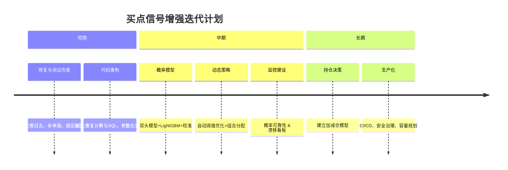

# 执行摘要

当前项目已按前次方案完成了多项升级：技术评分引入多维度子分项，构造了`bs_score_v2`（强买弱买分）、`bs_research_score`（研究建议分）、`bs_consensus_score`（共识分）等多阶段综合评分，并接入了概率化模型输出。评分流程更丰富：日终先计算传统技术因子分【21†L10-L18】【9†L122-L131】，然后调用模型输出的买入概率、预期回撤等信息，再结合动态门槛与影子池决策更新组合池（例如 `apply_bs_model_scores` 计算并填充了 `bs_model_prob`、`bs_model_rank_score` 等字段【30†L129-L138】【31†L153-L160】）。数据库交互和运维方面，也已移除硬编码凭据，加入了连接池，修复了分组聚合和函数查询的性能瓶颈【34†L73-L82】【41†L126-L135】。总体而言，系统现已具备**双重概率预测 + 风险约束**的评分框架，并可导出全市场打分结果。但仍有进一步完善空间。

下面我们将从**代码审查**、**信号评估**和**增强方案**三个维度进行深入分析，并给出下一步具体建议。

## 项目结构与评分流程

仓库结构清晰，将系统拆分为：数据采集（如 `sina/bs_detection` 抓取买点）、技术因子打分层（`scoreRank/strategies/technical.py` 调用 `core/scorer` 构造移动平均、突破、量比、RSI 等指标并线性加权）以及信号增强层（`core/bs_enhanced_score.py` 和 `bs_model_infer.py` 实现多阶段评分）。每日调度脚本 `scoreRank/cli/run_daily.py` 负责串接全市场数据：先获取前复权行情，调用技术打分产生基础 `score`，再执行以下步骤：

- **市场指标补充**：`enrich_scored_with_market_metrics` 向评分表补充当日市场覆盖度等统计特征【18†L670-L674】。
- **优化器加分**：调用 Factor Optimizer 为各因子赋类分（代码使用 `calculate_opt_score`，输出 `opt_*` 字段）。
- **增强打分**：通过 `add_bs_enhanced_scores(df)` 生成 `bs_score`、`bs_score_v2`、`bs_research_score` 等列【18†L670-L674】【9†L122-L131】。
- **市场情境**：构建 `market_context`（沪深300涨跌幅、行情状态等）并通过 `attach_market_context` 附加到 `scored`【18†L683-L690】。同时附加外部基本面特征（PE/PB/ROE 等）【47†L52-L61】。
- **模型推断**：加载最新训练好的 B 点模型，调用 `apply_bs_model_scores` 在 `scored` 内填充概率与排名分【18†L687-L694】【30†L127-L135】。
- **门槛决策**：动态计算交易/观察阈值（`resolve_bs_thresholds` 根据市场状态调整门槛【51†L42-L51】【51†L72-L81】），赋予 `dynamic_trade_threshold`、`dynamic_watch_threshold` 等列。将 `bs_score_v2` 与阈值比较并结合交易门禁，标记池类型（`TRADE`、`WATCH`）【18†L702-L711】。
- **影子池规则**：利用新得分与旧业务分共识，生成“影子交易池”预测（函数 `assign_shadow_pool` 实现；当模型与规则共识高时标为“TRADE”，否则“WATCH”）【18†L702-L711】【51†L100-L109】。

所有得分结果（包括池类型、模型分、门槛版本等）最终写入 `score_rank_daily` 数据库表【18†L734-L740】【35†L257-L265】。数据库表结构也同步添加了所有新字段，如 `bs_score_v2`、`bs_model_prob`、`bs_consensus_score` 等【16†L119-L127】【16†L128-L136】。

## 代码审查要点

- **重复调用**：`run_daily.py` 在不同阶段多次调用 `add_bs_enhanced_scores`（分别在技术评分后、附加外部特征后和模型推断后）【18†L672-L674】【18†L683-L693】。虽然确保了各列完整，但存在一定冗余计算开销，可优化为仅在必要时更新新增列，避免多次遍历全表。
- **阈值逻辑**：当前动态阈值计算规则较为简单、线性（如在熊市调紧、牛市放松）【51†L46-L54】【51†L72-L81】。可考虑引入统计学习方法自动确定调节系数，或依据回测效果反馈的方式微调策略，增强鲁棒性。
- **代码质量与安全**：前次已修复硬编码密码、查询参数化、连接池等问题。目前仍可改进：部分 `print` 调用可替换为日志记录（`logging_utils` 已集成，建议使用 `logger.info/error`）以提高可观测性；SQL 语句中的表名、字段建议使用常量或配置管理，减少字符串拼接风险；`save_scores_to_db` 手动映射列名繁复，可重构为数据框直接插入或使用 ORM 方式，以避免遗漏新字段。
- **性能与并行**：大批量数据操作仍集中在单机 Python。已向量化打分流程和数据库连接池等优化，但可进一步利用并行计算（如对不同股票分组计算时使用多线程或并行库）和批量写入加速保存过程。
- **测试覆盖**：已有针对评分函数和流程的单元测试（如 `test_bs_enhanced_score.py`、`test_run_daily_optimization.py`、`test_bs_signal_pipeline.py` 等）覆盖了主要逻辑【12†L32-L40】【44†L10-L18】【46†L63-L72】。建议继续补充回测结果和端到端流水线的集成测试，以捕捉模型更新或数据变动引入的问题。

## 信号评估与统计分析

根据导出的增强数据包，首买点事件在 20 日窗下的命中率约 **27%**（`hit_20_10pct` 平均≈0.27）。这说明当前买点候选整体命中率中等，而高分部分可能具有更高价值。因此，下步应专注于**概率化排序与风险加权**而非简单阈值选股。建议进一步做以下统计分析和验证实验：

- **分类质量**：对模型概率输出计算 **ROC-AUC**、**PR-AUC** 和**ECE (Expected Calibration Error)**【14†L178-L186】。检查模型分布与实际命中率的一致性（如使用可靠性曲线、Brier 分解），确保概率可信度。
- **门限敏感性**：比较不同`top-N`策略下的收益和风险，如每日选取概率最高的前5/10只股票，再比较它们的平均收益、最大回撤等【14†L176-L184】。可以采用配对bootstrap对比旧版规则和新版排序策略是否显著优越。
- **时间序列交叉验证**：当前样本切分已修正为走廊式（walk-forward）方案【14†L176-L184】。可进一步按行业或市场情绪分层验证，避免因行业集中度或极端事件对结果产生偏倚。还应对模型长期部署进行滑动窗口再训练测试，监测概念漂移。
- **交易成本评估**：严格模型评估应加入滑点和手续费敏感性测试【14†L180-L186】。建议在回测中分别测试不同成本档位（如10bp/15bp、20bp/15bp、30bp/20bp），并加入单只标的流动性约束（仓位不超过近20日均额的比例），验证策略是否能在实际市场下可执行。

## 信号增强方案

在现有二阶段混合模型基础上，我们提出以下信号增强方向：

- **分层多输出建模**：除了已有的“命中概率 + 预期回撤”模型，可尝试**多目标回归**直接预测未来涨幅分布或时序标签（如 5/10/20 日内的最大收益和回撤），利用如 XGBoost 的多输出或深度学习（LSTM/CNN）挖掘时间序列特征。这样可以丰富模型输出，以支持更灵活的选股决策（如按预期夏普比等排序）。
- **特征工程拓展**：现有特征主要为技术指标、基础财务数据和市场统计，可考虑引入更多**宏观/情绪指标**。例如：大宗商品价格、利率走势、市场情绪指数（如成交量突增、异动票涨幅分布）、新闻舆情（爬取财新或同花顺公告的负面关键词频率）等。这些或可捕捉**风险偏好变化**与个股异常行为，有助于在转折市场中更准确筛选买点。
- **集成学习与模型融合**：可尝试多个模型结果融合，例如用 LightGBM/XGBoost 对特征进行非线性优化，然后用逻辑回归在其输出基础上做概率校准【25†L108-L118】。此外，引入模型融合（如堆叠式模型，Stacking）将规则分、概率分、研究分等不同来源的预测进行加权，可能提高稳健性。
- **阈值自适应**：在`bs_threshold_policy`基础上，进一步考虑**贝叶斯优化**或强化学习来自动调整阈值，使得在历史回测中某个收益指标（如Sharpe或Hit Rate）最大化。同时，动态阈值可以进一步按每日入池数量和市场波动自动调整阈值范围，保证每天有稳定数量的候选。
- **实时调整与在线学习**：目前模型为离线训练，未来可探索**在线学习**或每周重训练机制。一方面使用OOS时间序列交叉验证监控模型性能（如均衡误差随时间的分布），及时发现模型老化；另一方面，对重要信号（如新上市公司、行业剧变）可以短期增补训练集（样本加权）以更新模型权重，减小延迟。
- **持仓管理层面**：当前系统重在选股信号，我们建议构建**加减仓模型**（使用 `active_b_daily_panel_labeled.csv` 构造持有、加仓、出清标签），对持仓逻辑进行建模。具体可训练一个“持有期模型”判断何时止盈或止损，或按行业/风格平衡来动态调仓，而非仅依赖固定持仓日数。这将使买点信号衍生成完整的交易策略。
- **组合优化约束**：引入组合层面优化，如最大化预期收益风险比或使用均值方差（Markowitz）框架，令选入池的股票按概率和风险自动分配权重，以限制个股集中度。也可设立单日轮换池，对交集较大的股票打折扣（避免买入众多相似票导致单边风险）。

## 优先级路线图

结合现状与可行性，建议如下升级路线图： 

- **短期（~1周）**：梳理并完成剩余工程改进，如统一使用**日志记录**替代打印、补全遗漏的单测用例、整理配置参数并撰写部署文档。确保所有新特征与字段在数据库、数据包和代码中同步，避免版本错位。
- **中期（2–4周）**：实施两头（双目标）模型与校准：在现有线性模型基础上引入 LightGBM/XGBoost，同时用 `CalibratedClassifierCV` 校准输出概率【25†L108-L118】；并完善指标看板，加入每周模型漂移监控（对预测概率和实际hit率差距报警）。同时部署**阈值自动调优**模块，利用历史回测结果自动搜索更优交易阈值。
- **长期（1–2月）**：开发持仓逻辑层：使用`active_b_daily_panel_labeled.csv`做完整的加减仓模型训练，使买点信号与持有决策一体化。引入实盘约束：在回测中加入流动性/换手上限、真实滑点模型，验证信号在实际交易下的表现。最后开展系统化治理：配置 CI/CD 流程、环境管理、权限控制和 Blueprint 服务化，提升生产稳定性。

以上升级按照成本收益比排序，短中期着重提高**预测能力和策略闭环**，长期聚焦生产化和风控。具体任务分解示例见下表：

| 阶段   | 工作内容                   | 验收指标                                        |
|------|-------------------------|--------------------------------------------|
| **短期** | - 优化代码（日志、类型提示、模块化） - 补充单元测试覆盖率 - 完善文档和配置管理    | 构建无报错，所有单测通过；导出/部署文档齐全         |
| **中期** | - 双目标模型（概率+回撤）训练与校准 - 回测协议完善（嵌套验证、成本敏感测试） - 实现自动阈值调优 - 建立模型监控（概率可靠性曲线、漂移） | 新模型显著提高样本外Hit率/信息比【25†L108-L118】；回测在各种成本档下仍优于旧版 |
| **长期** | - 加减仓/持仓模型训练 - 流动性和容量约束集成 - Web 服务与CI/CD搭建          | 完整交易策略净值曲线平滑回撤下降；生产环境稳定运行无故障 |

此外，可以用**Mermaid 时序图**概述信号增强项目的迭代节奏：

## 小结

总体看，当前系统已经从单纯规则分拣向**多阶段概率风险评分**演进，具备了较强的信号基础。接下来需聚焦于**预测能力**与**闭环可执行性**的提升：通过引入更强大的机器学习模型及组合层优化，使评分更具准确性，并在持仓管理和风险控制上添砖加瓦。我们同时建议继续重视架构健壮性和监控体系建设，确保信号在实盘环境下长期稳定有效。【9†L122-L131】【25†L108-L118】