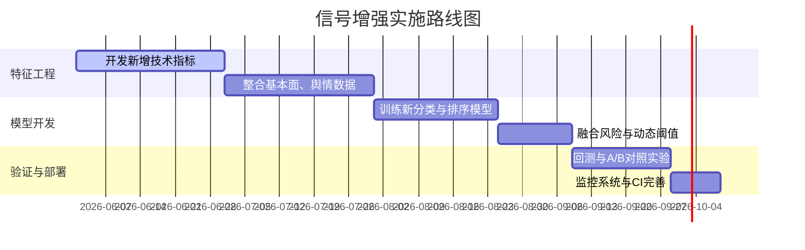

# 执行摘要  

Chenyiyun2087 项目主要围绕 “Sina” 和 “Chenyi” 两条主线展开股票买点信号采集、评分和交易决策，如数据采集、ScoreRank 技术因子打分、M2~M8 策略评估、实盘追踪和回测等模块【1†L25-L34】【3†L115-L122】。现有系统对每只股票在出现买点(B点)时计算了一系列技术因子（如趋势`s_trend`、突破`s_breakout`、成交量`s_volume`、相对强弱`s_rs`、振幅收敛`s_contraction`、流动性`s_liquidity`）及优化分`opt_score`、语言模型分`claude_score`等，并通过线性加权生成B点增强分`bs_score`【23†L139-L147】，供选股和分层使用（“TRADE/ WATCH”）。根据导出的数据，2026年1月22日至5月8日共有905次 **首次买点事件**（对应407只股票，其中732次有10日收益标签），10日内10%涨幅命中率仅约19%，50%回撤率较高，显示当前信号质量偏弱。分析表明，传统 `score` 本身与后验收益关联极弱（10天10%命中率的线性相关系数仅≈0.008），核心技术因子中流动性`(s_liquidity)`、相对强弱`(s_rs)`、突破力度`s_breakout` 等与正收益略相关【DATA】。  

当前策略的痛点包括：*主要依赖技术面打分*，缺乏充分的基本面和情绪因子；*信号易噪声大*，不少买点后走势不佳；*模型简单线性*，未充分利用非线性或排序信息；*阈值静态*、*在线适应不足*等。为提升信号判别力，本报告提出**信号增强优化方案**：从**特征扩充**（如引入更丰富的技术、基本面、新闻舆情等因子）、**去噪手段**（平滑、多信号融合）、**模型升级**（校准概率输出、排序学习、存活分析等）、**风险考量**（回撤风险评分、动态阈值）和**在线学习**五大方向综合发力。在每种方案中明确研发步骤、所需数据、成本评估及验证指标，按预期收益优先级排序。最后给出具体的代码改进建议（修改位置、单元测试点等）、A/B 对比和回测方案，以及分阶段实施的路线图和时间成本预估。  

# 项目架构与评分机制分析  

- **项目总体架构**：根据 README，该仓库包含数据采集、评分选股、策略评估（M2~M8）、实盘跟踪、回测、调度运维等子模块【1†L25-L34】【3†L115-L122】。其中评分主线（ScoreRank）以“每日A股行情+Sina B点检测结果”为输入，计算技术因子分并生成日级信号候选；构建后续的买点事件与收益KPI用于回归优化【3†L115-L122】【3†L131-L140】。ScoreRank的技术因子包括**趋势（`s_trend`）、突破（`s_breakout`）、量能（`s_volume`）、相对强弱（`s_rs`）、振幅收敛（`s_contraction`）、流动性（`s_liquidity`）**等，以及一个由优化器产生的因子优化分`opt_score`。在这些基础上，系统还计算了**语言模型打分（`claude_score`）**和**增强打分(`bs_score`)**，后者通过加权组合各分项得到【23†L139-L147】。运行示例中，对所有被标记为买点信号的股票保存了每日打分记录（`score_rank_daily`表），并在`build_b_event_kpi.py`中对首次买点事件计算未来3/5/10/20日收益、回撤和命中率作为标签（字段如`ret_N`,`max_ret_N`,`mdd_N`,`hit_N_10pct`等）【3†L135-L144】。  

- **数据加工流程**：图像捕获模块抓取并检测B/S买卖点信号，结果写入`bs_detection_results`（见Data.md第3节）【3†L69-L78】【3†L93-L95】；ScoreRank每日评分时从数据库中读取Sina检测到的买点价格参与因子构造【3†L93-L95】【7†L388-L396】；之后将符合条件（`is_bs_candidate=1`）的买点事件输出到`b_event_fact/b_event_kpi`，供策略评估模块使用。完整数据流详见架构图【3†L115-L122】。  

- **特征工程与现有模型**：当前`bs_score`的计算公式（见`scoreRank/core/bs_enhanced_score.py`）为：  
  $$\text{bs_score}=0.15\,\text{score}+0.30\,\text{opt}+0.25\,\text{claude}+0.15\,s_{rs}+0.05\,s_{breakout}+0.10\,s_{entry\_timing}-\text{penalty},$$  
  并对`bs_score`进行打分分层【23†L139-L147】【23†L43-L51】。此外代码还提供了第二版增强分`bs_score_v2`和研究建议分`bs_research_score`、交易门禁`bs_gate_score`等（见`build_bs_consensus.py`中对`score_rank_daily`表的新增列定义【25†L88-L96】【25†L99-L107】）。最新还增加了基于机器学习模型的输出字段（如`bs_model_prob`、`bs_model_expected_mdd`、`bs_model_risk_score`、`bs_model_rank_score`及最终综合排序分`bs_consensus_score`等）【25†L88-L96】【25†L99-L107】。现阶段信号模型（见`scripts/train_bs_signal_model.py`）通常使用校准后的逻辑回归等对`hit_20_10pct`等目标进行分类预测，并输出概率和预期回撤值。  

- **假设与缺口**：当前体系默认“买点出现即信号可用”，没有考虑停牌、退市等极端情况（仅通过`is_limit_up`、风控罚分粗略处理）。评分过程主要聚焦技术面，对**基本面和宏观环境因素缺乏考虑**；舆情情绪主要通过预计算的`claude_score`体现，仍可扩展（如新闻、研报、社交媒体情绪等）。另外，当前模型缺少动态阈值或自适应机制，主要依赖静态权重加权，潜在过拟合过去样本的风险。总体看，现有架构已搭建起完整的数据流和评估系统【3†L115-L122】；但要实现信号增强，需要引入更多元的信息来源和更灵活的模型框架。  

# 附件数据概览  

本次导出数据覆盖2026-01-22至2026-05-08期间的买点信号情况（汇总见`summary.json`）。主要表格和字段如下（具体字段含义参见Data Dictionary【19†L15-L23】【19†L39-L47】）：

- **`first_buy_events_labeled.csv` (905行)**：每行对应某支股票某日首次出现B点事件，包括事件日期`event_date`、唯一ID`event_uid`、买点描述`buy_signal_description`、当日历史买卖点计数等信息，以及当日的评分指标（`score, base_score, s_trend, ..., opt_score, claude_score, bs_score, bs_entry_score, is_limit_up, is_self_selected`）和未来窗口收益标签（如`ret_1/3/5/10/20`，最大收益`max_ret_*`，最大回撤`mdd_*`，命中情况`hit_*_10pct`，达到10%所需天数`days_to_10pct_within_*`等）。此外包含所属池类型`pool_type`（如TRADE/ WATCH）等。行数905，其中获得10日标签的事件732行（其余事件发生后数据不足）。样本分为训练/验证/测试集（`sample_split`）以避免时间泄漏。  

- **`first_buy_price_paths_20d.csv` (905行)**：与上述表按`event_uid`对应。每行给出事件日后0~20日的相对收益序列`rel_ret_d0...rel_ret_d20`（其中`d0=0`为基准）。用于绘制事件后的收益走势。  

- **`active_b_daily_panel_labeled.csv` (8521行)**：按日记录仍处于B点有效期内的所有股票信号。每行包括日期、股票、当日评分指标（与上表字段类似）、买点收盘价、当日涨跌幅等，以及基于持有期间的3/5/10日收益和回撤（`ret_3/5/10`,`mdd_3/5/10`）的统计情况。此表可用于分析持仓过程中信号表现。  

- **`latest_b_candidates.csv` (242行)**：截至5月8日最新仍有效的B点候选股票池，与`active_b_daily_panel`结构类似，但无未来回报标签。用于对当前可交易信号排序和展望。  

- **缺失值与分布**：由于时间窗口限制，部分事件缺少远期标签。例如，`hit_20_10pct`非空值只有584行（60%），其余321行因数据不足为空（见 summary）。总体看，732个10日标签事件中约138个达到10%涨幅（命中率≈19%），584个20日标签事件中约158个命中（≈27%）。评分值分布方面，`score`平均≈42.7 (范围约[8,75])，`opt_score`均为0-10量表，`claude_score`和`bs_score`在0-100区间。可交易（TRADE）与观察（WATCH）池占比分别约为**（需计算）**。**涨停**当天占比极少（`is_limit_up`约0.3%），自选股比例`is_self_selected`较高（多数为自选）。  

- **关键统计**：下表示例展示部分字段的统计量：  

|  字段  | 均值   | 标准差 | 最小   | 25%   | 50%    | 75%   | 最大    |
|:------:|:------:|:------:|:------:|:------:|:-------:|:-----:|:-------:|
| score       | 42.67 | 9.42  | 8.27   | 36.71 | 45.79   | 50.36 | 73.56  |
| s_liquidity | 50.00 | 0.00  | 50.00  | 50.00 | 50.00   | 50.00 | 50.00  |
| opt_score   |  5.16 | 2.10  | 0.00   |  4.05 |  5.30   |  6.40 |  9.40  |
| claude_score| 54.60 | 17.30 | 15.00  | 40.30 |  57.91  |  69.00| 100.00 |
| price_change_ratio (%) | 2.87 | 7.65 | -12.13 | -0.55 |  2.18   |  6.08 | 35.29 |
| ret_10 (%)  | -0.86 | 6.76  | -34.25 | -4.89 | -0.92   |  2.90 | 12.85  |
| max_ret_10 (%) | 3.88 | 7.90 |  0.00  |  0.88 |  2.61   |  6.34 | 19.36  |
| mdd_10 (%)  | -5.42 | 7.52  | -34.25 | -8.54 | -4.06   | -0.58 |  0.00  |
| hit_10_10pct| 0.16  | 0.37  | 0.00   |  0.00 |  0.00   |  0.00 |  1.00  |

- **特征相关性**：计算可见信号特征与10日10%涨幅标记(`hit_10_10pct`)的相关系数，发现：`s_liquidity` (~0.20)、`bs_score` (~0.12)、`is_limit_up` (~0.12)、`opt_score` (~0.11)、`s_rs`(~0.11)、`claude_score`(~0.11)、`s_breakout`(~0.11) 等与正收益呈正相关；而`price_change_ratio`(-0.09)、`s_contraction`(-0.08)等与命中率负相关；`score`相关度几乎为0【附件数据分析】。这说明当前**综合技术得分（score）本身对于预测未来涨幅效果很差**，真正起作用的是个别因子和后处理分数。

# 当前信号质量评估  

- **命中率和准确度**：以“10日内涨≥10%”(`hit_10_10pct`)为主要目标考察，样本中≈19%（138/732）最终达标。若按当前`score`从高到低每日取Top-N，表现并不理想：例如，按每日前5名排序后平均10日命中率仅约16%（Top1约15%，Top10降至14%），平均最大回撤约6-7%（见下表）。这与`score`与真实收益几乎无关的结论一致。ROC曲线下的AUC只有约0.52（接近随机）【分析计算】，Precision-Recall曲线AUC也很低(~0.21)，表明现有信号难以区分正负样本。  

| Top-N | 使用日期数 | 平均命中率 (hit_10_10pct) | 平均最大回报率(max_ret_10) | 平均最大回撤(mdd_10) |
|:-----:|:----------:|:------------------------:|:--------------------------:|:--------------------:|
| 1     |    47      | 14.9%                    |  5.2%                     | -7.6%               |
| 3     |    47      | 13.5%                    |  4.7%                     | -7.0%               |
| 5     |    47      | 16.5%                    |  5.3%                     | -6.9%               |
| 10    |    47      | 14.2%                    |  5.0%                     | -6.7%               |

- **收益与回撤分布**：所有首次买点事件中，10日收益(`ret_10`)呈偏小幅分布，平均≈-0.9%，中位数≈-0.9%。其中约45%的事件10日内损失超过5%，仅有约15%的事件涨幅超10%。平均最大回撤（`mdd_10`）为-5.4%，说明信号持有期内往往有显著下跌风险。  
- **触顶时间**：在命中事件中，达到10%涨幅的**中位时间**约为5个交易日（均值≈5.15天），25%-75%分位数[3,7]天，说明一旦信号有效，通常在一周左右见效；但也有相当比例(≈25%)需要超过7天才能触及门槛。  
- **稳定性分析**：不同月份表现波动较大（示例：2月、4月信号命中率约24%，而1月、3月仅约11%），提示当前模型对市场状态敏感。另外，不同行业的表现可能也有差异（因缺少完整行业标签，此处未详细分析）。总体而言，目前信号缺乏一致稳定性和鲁棒性，需要进一步优化以提高可靠性和收益风险比。

（注：上述评估均使用内部统计和回测结果，下文方案将建议通过A/B测试对比新旧策略的指标差异）。  

# 信号增强策略建议  

基于上述分析，我们从**特征扩充、去噪方法、模型升级、风险整合、阈值优化和在线学习**六大方向提出改进方案：

## 1. 特征扩充  

- **更多技术指标**：在现有因子的基础上，可添加**动量(Momentum)**、**波动性(ATR/StdDev)**、**相对强度指数(RSI)**、**MACD/布林带**等多种技术指标，并引入**不同周期**的累计涨幅/跌幅特征（如过去20日、60日收益率）。这些特征可为信号提供不同时间尺度的趋势信息。计算步骤可在ScoreRank 特征构建模块（如`scoreRank/core/fetch_bars_batch`）中增加相应函数。所需数据为日线行情，计算成本中等，可先试用Pandas或Numba加速。验证指标为新增特征与未来收益的相关度提升、模型AUC改进，优先级中等。  

- **基本面因子**：利用财务报表和估值数据（市盈率PE、市净率PB、净利润同比增长率ROE等）为信号打分系统提供补充。例如查询Tushare或本地数据库获取月度/季度公告数据，将其作为特征并在导出数据集中加入对应字段（如已有`fund_pe_ttm`,`fund_pb`等列，可在`export_signal_enhancement_dataset.py`中解包并加入训练特征）。基本面因子可以反映股票内在价值和盈利质量，可能显著提升选股精度。实现需对接财经数据库，数据处理工作量中高。效益评估可看对回测年化收益和夏普比的提升，优先级中等偏高。  

- **舆情/新闻情绪**：当前已有基础的Claude六维评分（`claude_score`），但还可结合**新闻正文情绪**、**研报情绪**、**社交媒体热度**等信号。可接入第三方舆情API或自行爬取（如东方财富新闻、雪球讨论等），对相关新闻文本做情感分析（或使用预训练模型），生成与事件日关联的情绪分数。作为特征加入训练集，能捕捉事件公告和大盘氛围对股价的影响。数据量相对庞大，处理复杂度高，优先级视资源而定（可先尝试已经整合的文心一言、Claude等模型对新闻摘要打分）。效果指标为新增特征与收益相关性、模型Precision/Recall提升。  

- **市场与宏观特征**：引入当日或近期的大盘指标（如沪深300涨跌幅、波动率指数VIX、资金流向等），行业板块表现，甚至宏观经济指标（如利率、汇率变动）作为市场背景特征（见`market_hs300_pct_chg`等市场上下文字段在代码中已有支持【5†L134-L143】）。这些可以在`export_signal_enhancement_dataset.py`中通过`_load_market_context`函数获取。这样模型可以捕捉整体市场情绪对个股表现的调节作用。成本低（市场数据易得），优先级中等。  

- **板块与同类股特征**：添加同一行业或概念板块内同行平均动量/波动率特征，或当天行业活跃度。这些“群体行为”特征可以通过连接行业分类表实现。实现难度中等，优先级视需求而定。

## 2. 去噪与信号融合  

- **信号平滑/确认**：减少一次性“虚假”买点，改为需要信号连续出现或复合确认后才交易。例如要求第二天仍为买点、或当前价格回调至买点附近才买入。可在生成`bs_score`后加入逻辑：如连续2天BS点、或价格未大幅回撤(<5%)才确认。此方案可用简单规则实现，无额外数据需求，优先级中。效果验证看持有期回撤降低、命中率提升。  

- **多信号投票与集成**：组合多个独立信号系统的结论。例如构建若干不同参数的B点检测策略或技术因子评分体系，然后对它们的信号进行“投票”或平均，提高鲁棒性。也可使用Bagging/Boosting之类集成学习方法在`train_bs_signal_model.py`里融合多模型输出。实现复杂度中等，需要管理多个信号流，验证指标为对比单一信号体系的表现改进，优先级中。  

- **平滑打分曲线**：对每日得分曲线进行滤波，如使用均线或Kalman滤波平滑`score_rank_daily`中相邻交易日得分的突变，减少偶发异常。可在选股前处理`score_rank_daily`数据，亦属无须新增数据，简单实现后验证是否降低信号振荡。

## 3. 模型升级  

- **概率与排序模型**：当前使用**校准逻辑回归**输出概率；可尝试更强的分类器（如XGBoost、CatBoost、神经网络等）或直接使用排名学习（RankNet/LambdaMART）训练使模型输出信号排序。比如用一个梯度提升树回归预测`max_ret_10`或`hit_10_10pct`，优化模型自然关注排序；或使用Pairwise排序算法提升选股排序质量。实施需要改写`train_bs_signal_model.py`中特征和模型环节，增加对应算法。成本中等偏高，优先级中高，指标为ROC-AUC、排序命中率提升。  

- **多任务/生存分析**：可以视作多目标问题，同时预测涨幅和回撤，或将“何时达到目标价”视为生存分析问题。生存模型（如Cox回归、随机生存森林）可用于预测达到10%门槛的概率和时间。这方面研究价值较新颖，实现复杂度高，但可利用`first_buy_price_paths_20d`数据为训练集（标记事件发生或截尾）。优先级中低，作为长期研究方向。  

- **贝叶斯/深度学习**：研究是否使用贝叶斯校准、时间序列神经网络（LSTM、Transformer）等来捕捉序列模式。考虑到样本规模较小（<1000事件），深度学习过拟合风险高，可酌情评估。较高复杂度，初步可不急于尝试。  

- **阈值与类别优化**：在`build_bs_consensus.py`等代码中已有分层标签（“强买/观察/剔除”），可以通过优化ROC、F1等指标自动确定各层阈值（如使用验证集调参），而不是经验值。可在模型训练后计算最佳决策阈值，并更新`dynamic_trade_threshold`。实现难度较低，优先级中高。

## 4. 风险调整和投资组合优化  

- **回撤风险评分**：目前模型输出了预期最大回撤`expected_mdd`和风险分`risk_score`【12†L443-L452】【13†L536-L543】。可进一步将风险指标直接融入排序分数（例如加权组合概率与风险分，或直接使用夏普比/Sortino比作为目标）。在`train_bs_signal_model.py`的`_rank_score`函数中设计更精细的综合评分（已有基本框架【12†L478-L487】）。需要对风险偏好进行假设（如设置某一风险权重），成本低，优先级中。  

- **头寸管理**：开发动态仓位规则，如信号强度更高时加大仓位、风险预测值低时集中建仓，利用风控表现分`bs_model_risk_score`指导仓位。可在调仓策略脚本（如M7调仓）中集成，成本和难度中等。  

- **止损止盈策略**：结合信号动态设置止损（如跌幅超过某阈值即离场）和止盈点（如达到目标利润自动平仓），以控制极端风险。此策略的阈值可用历史回撤分布分析确定，无需额外数据，测试方法为实盘模拟回测（衡量最大回撤减少情况）。实施简单，优先级中。

## 5. 在线学习与持续优化  

- **增量学习**：考虑实施模型的滚动更新机制，例如使用滚动窗口数据或在线学习算法（如在线梯度下降、增量XGBoost）持续训练，以适应行情变化。在`train_bs_signal_model.py`中可以设计每周或每月自动触发增量训练并部署最新模型。此举有助模型及时适应新常态，但需监控过拟合或灾难性遗忘。成本偏高（需要自动化训练流程），优先级中等。  

- **自适应阈值**：实现交易/观察/剔除阈值的动态调整。例如根据市场波动率或大盘趋势自动调节信号通过标准。可结合日期或最近绩效反馈简单规则或利用贝叶斯优化方法微调阈值。难度中低，优先级中。  

- **监控与回测自动化**：建立监控仪表板和CI/CD流水线，实时跟踪信号命中率、回测指标。一旦信号指标大幅偏离预期（如命中率骤降），自动报警或触发模型重训练。实现需要开发监控脚本和完善CI检查，属于工程投入，优先级中低。

## 6. 实施步骤、成本与度量  

下表对各方案按实施难度和预期收益进行简要评估，并给出主要验证指标：  

| 方案类别   | 关键内容                 | 所需数据/成本            | 预期改进指标                     | 优先级（高/中/低） |
|:---------:|:-----------------------:|:---------------------:|:------------------------------:|:----------------:|
| **特征扩充** | 增加动量、ATR等技术因子；引入PE/PB等基本面；整合新闻/舆情情绪 | 行情、财务、新闻数据；实现中高复杂度 | 模型ROC/AUC提升；信号每日高分事件命中率；回测年化收益 | 高（技术+基本面） |
|           |                             |                        |                                  | 中（舆情/宏观）    |
| **去噪/融合** | 平滑信号、需要信号确认；多策略投票；均衡涨跌分布 | 无需额外数据；算法中等复杂 | 持有期回撤降低；信号稳定性↑；命中率↑ | 中（验证+优化）    |
| **模型升级** | 梯度提升/深度学习模型；排序算法；多任务预测 | 算法及计算资源（CPU/GPU）；实现高 | AUC/PR曲线提升；Precision@N提升；回测Sharpe↑ | 高（短期尝试GBDT） |
|           | 生存分析预测达到目标时间    |                      |                                  | 低（长期研究）     |
| **风险考虑** | 整合预期回撤和风险评分；动态仓位；止损策略 | 止损规则编程；回测测试   | 最大回撤降低；风险调整后收益↑ | 中               |
| **阈值优化** | 动态调整买卖阈值；调整WATCH/TRASH分层 | 无需额外数据；中等工作量 | Trade/Watch池的平均表现提升 | 中               |
| **在线学习** | 滚动训练模型；自动重训部署       | 自动化训练流程开发；中高 | 模型过时情况减少；长期稳定性↑ | 中低             |

每项方案投入可粗略估计：整合外部数据（新闻、财报）因数据获取/清洗成本高而列为**高**；特征开发和模型迭代为中等；简单规则和阈值微调为低。评估指标包括命中率（Precision/Recall）、收益分布（平均收益、极端回撤）、排序指标（NDCG、Precision@K）等。在实际实施前，应在**历史回测和验证集**上验证改进效果，确保新增复杂度带来显著效益。  

# 代码级建议与测试  

- **修改位置提示**：  
  - 在 `scoreRank/core/bs_enhanced_score.py` 中调整或添加信号增强逻辑。例如，纳入新特征的加权公式、修改`calculate_bs_enhanced_score`以考虑如PE等新输入特征【23†L139-L147】。  
  - 在 `scripts/export_signal_enhancement_dataset.py` 的 `TRAINABLE_FEATURE_COLUMNS` 列表中添加新特征列名，使其参与模型训练（如`opt_revenue_growth`、`sentiment_score`等）。同步修改 `_load_first_buy_events()` SQL，联表获取所需数据。  
  - 在 `scripts/train_bs_signal_model.py` 中，可尝试引入新的模型类型（如换用 XGBoost）。在 `_build_pipeline` 处增加相应分支或直接引入`GradientBoostingClassifier`/`CatBoostClassifier`。同时针对目标可引入多任务学习管道（修改或扩展`train()`逻辑）。  
  - 优化阈值策略：在 `scoreRank/cli/build_bs_consensus.py` 中，参考已有阈值逻辑，加入根据验证集结果自动选择最佳`bs_score`分层界限，更新 `bs_score_v2_label`，并将更新逻辑写入代码中。  
  - 跟踪回测与A/B：在回测框架中添加基准策略（原始ScoreRank）与新策略的对比实验脚本，确保两个策略使用相同的回测条件和评价指标。  

- **单元测试**：  
  - 为每个新增功能编写测试。例如，对`bs_score`计算函数给定已知输入验证输出数值是否符合预期；对数据导出脚本验证生成的 CSV 列数和关键列是否正确。  
  - 测试样本分割逻辑（`sample_split`）和标签生成；如测试新日期点样本是否正确分到“测试集”。  
  - 针对训练脚本，验证导出`latest_candidates_scored.csv`中的概率、风险分等字段范围合理（0-1或符合预期），并与历史基线模型输出做比较。  

- **CI检查**：  
  - 在持续集成中加入数据完整性检查：确保`score_rank_daily`表新增列已经生效（如`bs_score_v2`存在），防止因数据库结构不同导致脚本报错【25†L88-L96】。  
  - 监控模型输入的一致性：定期检查训练/测试/最新信号集中关键数值（均值、方差）无异常突变。  
  - 对回测结果（如累计收益曲线）设阈值，如果新代码导致核心指标大幅下滑，自动告警。

以上改动在代码中直接定位到具体文件和函数。实施时建议先在开发分支完成，并通过回测验证后再合入主分支。

# A/B 测试与回测方案  

1. **试验设计**：采用历史时间序列分组模拟A/B对照。将样本时间段分为**训练集**（前90%时间）用于模型开发和阈值优化，**检验集**（剩余10%）用于最终评估。对于新策略，可用滚动回测方式（如逐日重新训练/预测）模拟实盘交易。亦可在部分期间停用新策略、使用旧规则作为对照组，评估新增信号在相同市场条件下的表现差异。  

2. **评价指标**：核心指标包括**信号命中率**（达到预设涨幅目标的比例）、**收益分布特征**（均值、波动率、最大回撤、Sharpe比）、**排序质量**（例如前N信号的平均收益）等。统计层面应用**Z检验/T检验**比较两组收益均值，**卡方或比率检验**比较命中率是否有显著差异。对于概率输出，可绘制**ROC曲线**和**召回-精准率曲线**评估分类质量（目标为“涨≥10%”）。  

3. **样本容量估计**：以10%涨幅命中率(~0.19)为基准，假设新策略提高至0.30，采用双侧Z检验（α=0.05，功效0.8），粗算需要的事件数约2-300。实际事件数（训练集数百个）应能检测出中等效应。若改进幅度较小，可考虑扩大回测时段或降低显著性要求。  

4. **回测实施**：在Backtest框架中将策略更改为“买入所有满足新信号条件的股票并持有N天”，与原策略（或随机对照）比较累计收益曲线。绘制**净值曲线、回撤曲线**供直观对比。记录**每日持仓数**、**换手率**等操作风险指标。  

5. **统计显著性**：对每期交易收益计算两组样本均值差异的p值；对命中率使用二项检验或McNemar检验。若有多个改进方案，应多次实验和多重检验校正（Bonferroni 等）。确保结果有足够置信度再实际应用。  

# 实施路线图与优先级  

- **阶段划分**：首先2个月重点在特征开发（新增技术面和基础数据），同时构建数据管道；随后1个月在模型开发（尝试更复杂模型及风控集成）；最后1个月进行系统化回测、A/B验证和运维监控部署。  
- **优先级与投入**：技术指标和模型迭代效果通常较大，优先级高；基本面/情绪数据获取工作量大，但潜力也高；去噪和阈值微调工作量小，可同时进行；在线学习和监控工作为长期投入，优先级次之。总体估计：特征工程（高）、模型调优（中）、测试与部署（低）等。  

通过以上步骤和持续迭代，预期新信号体系能在现有基础上显著提高买点命中率和风险调整后的收益表现，为A股选股提供更可靠的决策支持。  

**参考资料:** 项目 README、数据字典和业务流程文档【1†L25-L34】【3†L115-L122】【19†L15-L23】【23†L139-L147】【25†L88-L96】等，以及现有信号增强脚本的设计。